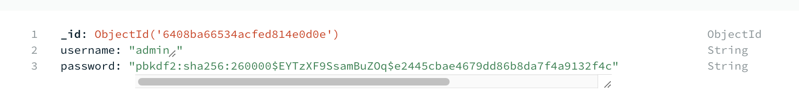
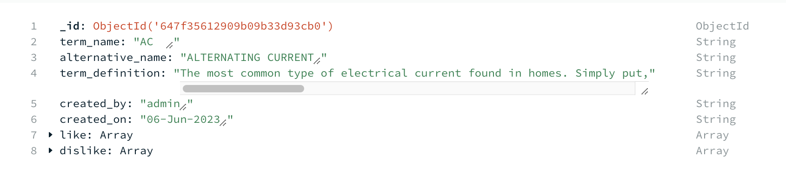
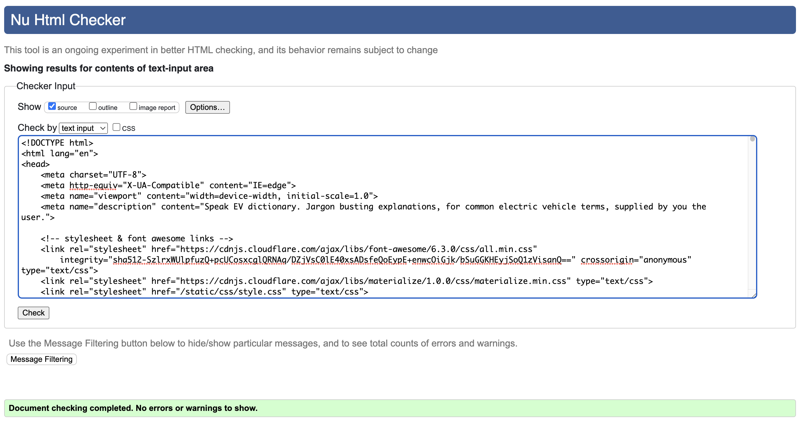
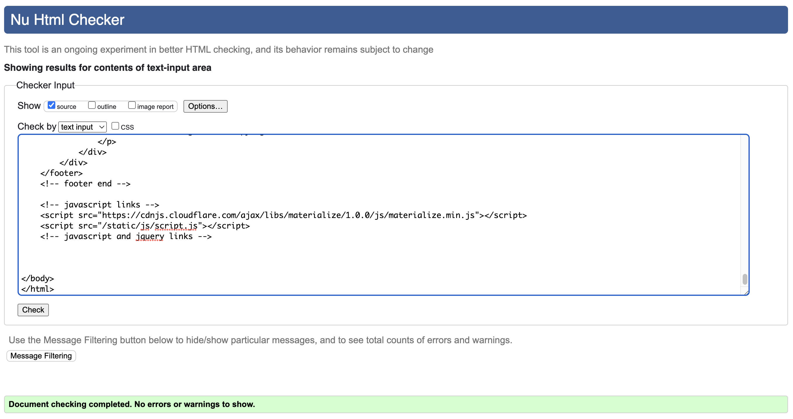
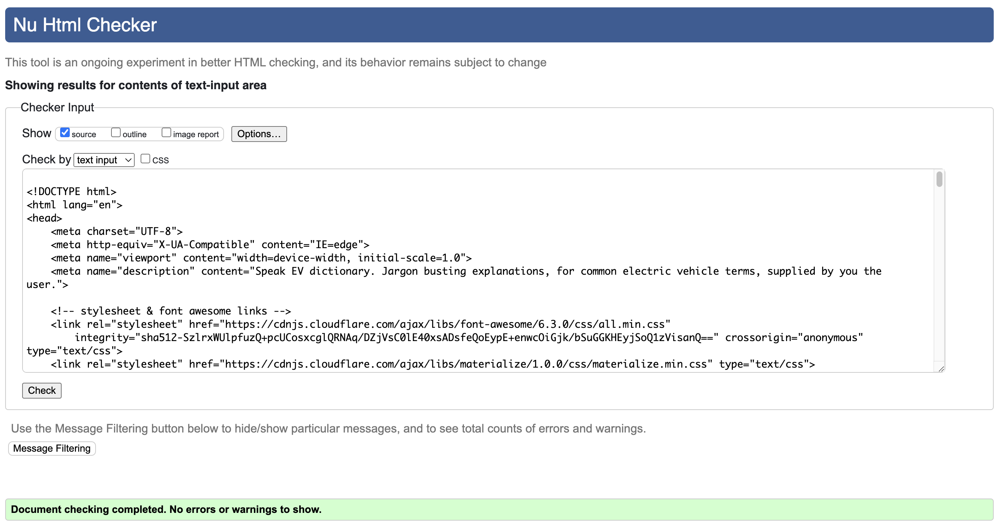
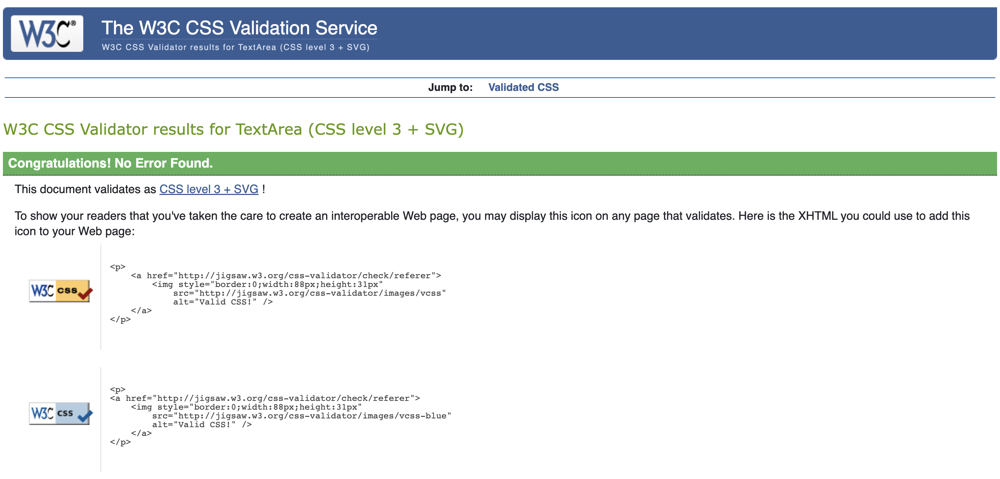
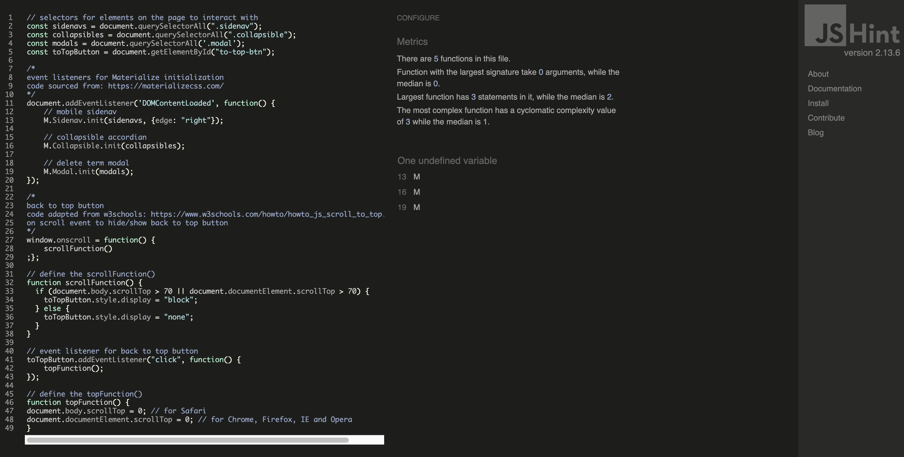
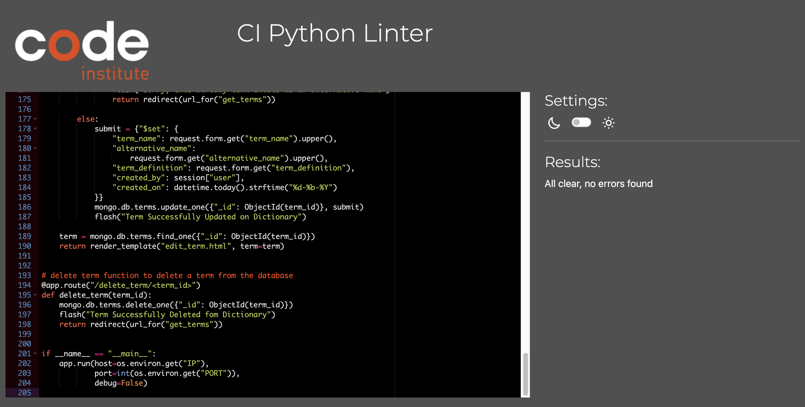
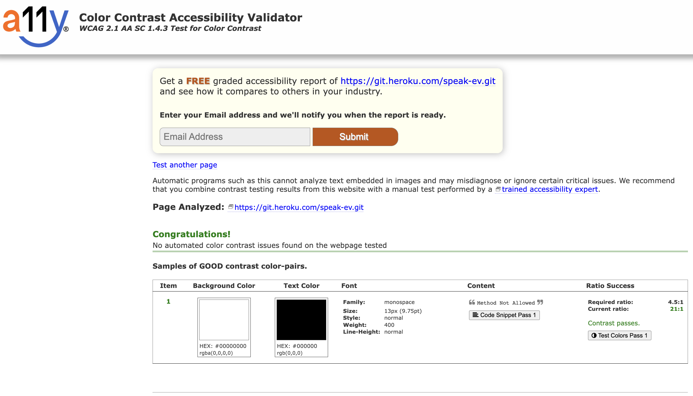

# Speak EV

Speak EV is a crowdsourced dictionary of terms and jargon related to electric vehicles (EVs). The site allows any visitor to view the dictionary and registered users to add their own terms to it. As EVs are a new and ever developing technology, it can be hard to keep up with all of the associated terms and acronyms. This is especially true for people adopting, or wishing to adopt, the technology for the first time. Speak EV aims to help demystify EV terms and jargon, making it accessible to all.

The primary technologies used to form the basis of this website are the coding languages HTML, CSS, JavaScript, Python, the Flask micro framework and template language Jinja. These were used in conjunction with the document based, non-relational database, MongoDB and deployed on Heroku.

[View the live site here](https://speak-ev.herokuapp.com/)

&nbsp;

# Table of Contents
  * [UX and UI](#ux-and-ui)
    * [Research](#research)
    * [User Stories](#user-stories)
    * [User Requirements and Expectations](#user-requirements-and-expectations)
    * [Design](#design)
    * [Wireframes](#wireframes)
  * [Database](#database)
  * [Features](#features)
    * [Existing Features](#existing-features)
    * [Features to be Implemented in the Future](#features-to-be-implemented-in-future)
  * [Technologies Used](#technologies-used)
    * [Languages](#languages)
    * [Frameworks](#frameworks)
    * [Template Engine](#template-engine)
    * [NoSQL Database](#nosql-database)
    * [Application Platform](#application-platform)
    * [Version Control](#version-control)
    * [Libraries](#libraries)
    * [Testing and Validation Tools](#testing-and-validation-tools)
  * [Testing](#testing)
  * [Validation](#validation)
    * [HTML](#html)
    * [CSS](#css)
    * [JavaScript](#javascript)
    * [Python](#python)
    * [Color Contrast](#color-contrast)
  * [Deployment](#deployment)
    * [Creating a GitHub Repository](#creating-a-github-repository)
    * [Forking the GitHub Repository](#forking-the-github-repository)
    * [Making a Local Clone](#making-a-local-clone)
    * [MongoDB: Database Setup](#mongodb-database-setup)
    * [Heroku Deployment](#heroku-deployment)
  * [Credits](#credits)

&nbsp;

# UX and UI

## Research

Research for the creation of this site was carried out by searching for various forms of EV dictionary currently in existence. A selection of sites found are shown below, all of which are generated by the site owner and don't allow for user generated additions.

* [My EV](https://www.myev.com/research/ev-101/ev-terminology)
* [Pod Point](https://pod-point.com/guides/driver/ev-dictionary)
* [Electrifying](https://www.electrifying.com/ev-dictionary)
* [Go Green](https://www.gogreenleasing.co.uk/blog/ev-dictionary)

&nbsp;

## User Stories

**Site Admin**
| ID | As a...         | I want to be able to...            | So that I can..                                        |
| -- | --------------- | ---------------------------------- | ------------------------------------------------------ |
| 1  | **Site Owner**  | maintain a user generated resource | inform recent and potential adopters of EV technology. |
| 2  | **Site Owner**  | have admin credentials             | curate and moderate the site content.                  |
| 3  | **Site Owner**  | manage all dictionary terms        | view, add, edit and delete terms on the site.          |

&nbsp;

**Viewing & Navigation**
| ID | As a...         | I want to be able to...                    | So that I can..                                          |
| -- | --------------- | ------------------------------------------ | -------------------------------------------------------- |
| 4  | **Site User**   | easily see the purpose of the site         | be informed as to whether it meets my needs.             |
| 5  | **Site User**   | browse the dictionary without signing-up   | find and read definitions for all terms.                 |
| 6  | **Site User**   | see how many likes and dislikes a term has | trust the quality of the term and associated definition. |
| 7  | **Site User**   | search for keywords                        | quickly find the term I am looking for.                  |

&nbsp;

**Registration & User Accounts**
| ID | As a...              | I want to be able to...            | So that I can..                                         |
| -- | -------------------- | ---------------------------------- | ------------------------------------------------------- |
| 8  | **Site User**        | easily sign-up for a new account   | add new terms and like/dislike existing terms.          |
| 9  | **Registered User**  | easily login and out of my account | use the site with the advantages of a registered user.  |
| 10 | **Registered User**  | like and dislike dictionary terms  | rate the quality of the term and associated definition. |
| 11 | **Registered User**  | add new dictionary terms           | share my knowledge with the community.                  |
| 12 | **Registered User**  | edit my dictionary terms           | correct and update my dictionary entries.               |
| 13 | **Registered User**  | delete my dictionary terms         | remove my unwanted dictionary entries.                  |
| 14 | **Registered User**  | have a personal user profile       | view all terms that I have contributed.                 |

&nbsp;

## User Requirements and Expectations

### Requirements

  * Familiar and intuitive design that negates any learning curve.
  * A reactive site that is user friendly and well presented on all types of device and screen sizes.
  * Adequate levels of color contrast across the site that presents content in an accessible and easy to read manner.
  * Appealing visual presentation that enhances the user experience.
  * Full CRUD functionality
    * Create: registered users can create new dictionary terms.
    * Read: all users can read dictionary terms and definitions.
    * Update: registered users can update their own entries.
    * Delete: registered users can delete their own entries.

### Expectations

  * Feedback when interacting with the site that is also instructive.
  * Color choices for links and buttons should be familiar and logical.

&nbsp;

## Design

### Imagery
* An image of a Nissa Leaf EV charging was chosen as a hero image for the homepage. The Nissan Leaf was the world's first mass-market battery electric vehicle (BEV) when it arrived in 2010 and is now sold in 59 markets worldwide. It is an iconic vehicle in the world of electric vehicles and was an obvious choice for visually demonstrating to the user that the site is related to EVs.

### Color Scheme

* Black (#000), white (#fff) and green (#76ff03) are the primary colors applied throughout the site. These are complemented by the use of various shades of grey (#bdbdbd, #eeeeee, #fafafa, #212121, #59595) red (#d50000, #ff1744) and blue (#1a237e, #1565c0). The main colors of black and white were chosen to provide a clean modern feel while providing excellent contrast. The green color was chosen as it is intrinsically linked to 'green' technologies while the bright lime shade was chosen to demonstrate the excitement of new EV technologies; all the while maintaining good contrast. Shades of grey are applied to provide definition from the background in such areas as the footer, forms, and on the collapsible text-area. They are also applied to text-input labels and to differentiate text in the collapsible text-area. Finally, shades of red are applied to the cancel and delete buttons while shades of blue are applied to text links; these were chosen in order to meet user expectations and existing conventions.

### Fonts

* The Google font of Rubik was chosen for the text throughout the site. It is from the sans serif font family with slightly rounded corners which give it a clean modern feel, in keeping with the overall site design aesthetic. Additionally, the font is extremely legible providing good contrast in all colors and sizes.

### Structure

* The information architecture type used for this site is the hierarchical tree structure. This common structure allows for simple navigation throughout the site and allows for easy expansion of the site in the future. The use of the burger navigation icon, along with a floating return to top button, help to overcome the common issues with this structure on mobile devices.

<details>
<summary>Site Map</summary>


</details>

&nbsp;

## Wireframes

* Balsamiq Wireframes was used to create the wireframes for this site. 
Wireframes for mobile and desktop can be found below:

  ### [Phone Wireframe](readme-files/wireframes/mobile_wireframes.pdf)

  ### [Desktop Wireframe](readme-files/wireframes/desktop_wireframes.pdf)

&nbsp;

[Back to top &uarr;](#speak-ev)

# Database

  MongoDB is a non-relational database that has a flexible data model. It was chosen as the database for this project as there are few relationships between the collections. This project consists of two collections, one for 'terms' and a second for 'users'. Within the collections each document has several key-value pairs, these are outlined below.

## users
| Key      | Value    | Description                    |
|----------|----------|--------------------------------|
| _id      | ObjectId | primary key                    |
| username | String   | username chosen during sign-up |
| password | String   | werkzeug salted password hash  |



## terms
| Key              | Value    | Description                                              |
|------------------|----------|----------------------------------------------------------|
| _id              | ObjectId | primary key                                              |
| term_name        | String   | main term name.                                          |
| alternative_name | String   | secondary term name (if any)                             |
| term_definition  | String   | definition of the term                                   |
| created_by       | String   | username from users collection                           |
| created_on       | String   | datetime automatically added                             |
| dislike          | Array    | users _id is added to the array when they dislike a term |
| like             | Array    | users _id is added to the array when they like a term    |



  In the 'users' collection above, the value associated with the 'username' key is entered by a new user when they are generating an account. This is an alphanumeric value, controlled by the use of the pattern attribute in the username input, and is checked against existing 'username' values in the database to prevent duplication; as shown by the code snippet below.
  
  ```
    # sign up function to add new users to the database
    @app.route("/sign_up", methods=["GET", "POST"])
    def sign_up():
        if request.method == "POST":
            # check if username already exists in the database
            existing_user = mongo.db.users.find_one(
                {"username": request.form.get("username").lower()})

            if existing_user:
                flash("Username already exists")
                return redirect(url_for("sign_up"))
  ```

  This is important as the 'username' value is referenced in the 'terms' collection, when a user creates a new term, their username is recorded and stored as the value for the "created_by" key. Additionally, the value of the '_id' key in the 'users' collection is referenced in the 'terms' collection as a value for the 'dislike' and 'like' keys; the users_id is added and removed, from the relevant array, as users like and dislike term definitions in the dictionary, as shown by the like code snippet below.

  ```
    # like a term definition
    @app.route("/like/<term_id>", methods=["GET", "POST"])
    def like(term_id):
        if "user" in session:
            # find the user
            user = mongo.db.users.find_one(
                {"username": session["user"]})

            # find the term using the term_id
            term = mongo.db.terms.find_one(
                {"_id": ObjectId(term_id)}
            )

            # if user has already liked the term, remove like
            if user["_id"] in term["like"]:
                mongo.db.terms.find_one_and_update(
                    {"_id": ObjectId(term_id)},
                    {"$pull": {"like": user["_id"]}}
                )
                flash("You unliked '" + str(term["term_name"]) + "'")
                return redirect(url_for('get_terms'))

            else:
                # if user has already disliked term, remove dislike
                if user["_id"] in term["dislike"]:
                    mongo.db.terms.find_one_and_update(
                        {"_id": ObjectId(term_id)},
                        {"$pull": {"dislike": user["_id"]}}
                    )
                # find term and update the like array with the user_id
                mongo.db.terms.find_one_and_update(
                    {"_id": ObjectId(term_id)},
                    {"$addToSet": {"like": user["_id"]}},
                    {"upsert": "true"}
                )
                flash("You liked '" + str(term["term_name"]) + "'")
                return redirect(url_for('get_terms'))
  ```

&nbsp;

[Back to top &uarr;](#speak-ev)

# Features 

## Existing Features

* Navigation Bar

  * Featured on all pages, the full responsive navigation bar includes links to the Home, Log In, and Sign Up pages for all unregistered site visitors.
  * When signed in, the navigation bar includes links to the Home, Profile, Add Term and Log Out pages for all registered users.
  * It is identical on each page to allow for easy navigation and good UX.
  * It allows the user to easily navigate from page to page across all devices without having to revert back to the previous page via the ‘back’ button.
  * The navigation menu will collapse into a burger icon on mobile screens allowing for a more user friendly and aesthetically pleasing experience.
  * When used on a mobile device a side navigation menu expands on the right hand side of the screen, displaying all options available on the desktop navigation bar.

    

    <details>
    <summary>Navbar: Mobile</summary>

    

    </details>
    
    <details>
    <summary>Sidenav: Mobile</summary>

    

    </details>

* Main Heading Card

  * An image of a Nissa Leaf EV charging is used as a hero image, within the main heading card, on the homepage. It is an iconic vehicle in the world of EVs and was an obvious choice for visually demonstrating to the user that the site is related to EVs.

    

  * The main heading card also contains a < h1 > element, with a tagline for the site, which is followed by a line of text that provides a simple and concise description of the site's purpose. At the bottom of this section lies hyperlinked text which links to the sign-up page (for non registered users) or add term page (for registered users).

    

* Search Panel

  * The search panel consists of a text-input field, where users can type their search word, which is followed by 'search' and 'reset' buttons. The text-input field is labelled, to indicate its purpose, and provides feedback to the user to ensure that they cannot submit an empty string. Search words can be submitted by an enter keypress or by selecting the 'search' button and reset by selecting the 'reset' button. 

    

* Homepage: Collapsible

  * The collapsible is used to display the term names and to show/hide the term definition; along with information regarding the user who submitted the term, the last updated date, an alternative name for the term (if any) and like/dislike buttons. When a user selects a row on the collapsible, it reveals the term definition and a subsequent selection hides it again. If a secondary row is selected, when another row is already open, the new row will open while the previously selected row will be hidden. Additionally, the site admin will have access to two further buttons within the open collapsible, allowing them to edit and delete terms; registered users will only have these buttons shown for their own terms. These 'Edit' and 'Delete' buttons link to the edit term page and a delete term modal respectively.

    

* Profile: Header

  * The profile header contains a < h1 > element, consisting of the user's name, which is followed by an 'Add Term' button which links to the add term page.

    

* Profile: Collapsible

  * The collapsible is used to display the term names and to show/hide the term definition; along with information regarding the user who submitted the term, the last updated date, an alternative name for the term (if any) and like/dislike buttons. Additionally, 'Edit' and 'Delete' buttons are available to the user which link to the edit term page and a delete term modal respectively. On the profile page, the terms listed are just those created by the session user. When a user selects a row on the collapsible, it reveals the term definition and a subsequent selection hides it again. If a secondary row is selected, when another row is already open, the new row will open while the previously selected row will be hidden.

    

* Edit Term Form

  * A page header sits above the edit term form, containing a < h1 > element, it informs the user of their location within the site. The edit term form auto populates with the information pertaining to the selected term. This information can be updated and submitted using the 'Edit Term' button. If the changes are valid, a flash message will appear at the top of the screen notifying them that the term has been successfully updated. Should the edited term match an existing term, or alternative name for an existing term, they will be redirected to the homepage and receive a flash message notifying them that the term, or alternative name, already exists within the dictionary.

    

* Delete Term Modal

  * Should the user, or admin, select the 'Delete' button, within the collapsible, a modal will appear. The main modal text will ask the user if they are sure that they want to delete the selected term. Beneath this, is text stating that this action cannot be undone. A 'Cancel' and a 'Delete' button sit in the modal footer with the former used to close the modal, without deleting the term, and the latter to confirm deletion. Should the deletion of the term be confirmed, they will be redirected to the homepage and a flash message will appear notifying the user that the term has been successfully deleted.

    

* Add Term Form

  * A page header sits above the add term form, containing a < h1 > element, it informs the user of their location within the site. The add term form consists of two mandatory text-fields ('Term Name or Acronym' and 'Term Definition') and an optional text-field ('Alt Name'). The text-input fields are labelled, to indicate their purpose, and provide feedback to the user to ensure that they cannot submit an empty or invalid string. A complete form can be submitted using the 'add term' button. If the term name is valid, they will be redirected to the homepage and a flash message will appear at the top of the screen notifying them that the term has been successfully added to the dictionary. Should the new term match an existing term, or alternative name for a term, the add term form will reset to its default state and they will receive a flash message notifying them that the term already exists within the dictionary.

    

* Log-In Page

  * A page header sits at the top of the page containing a < h1 > element, it informs the user of their location within the site. The header is followed by two text-input fields for the user's 'username' and 'password' with a 'log in' button underneath. At the bottom of this section lies hyperlinked text which links to the log-in page, should the user be unregistered. The input fields are labelled, to indicate their purpose, and provide feedback to the user to ensure that they cannot submit an empty or invalid string. If the user details are valid, they will be redirected to the profile page and a flash message will appear at the top of the screen welcoming them. Should invalid user details be submitted, the user will receive a flash message notifying them of an incorrect username and/or password.

    

* Sign-Up Page

  * A page header sits at the top of the page containing a < h1 > element, it informs the user of their location within the site. The header is followed by two text-input fields for the user's desired 'username' and 'password' with a 'Sign Up' button underneath. A line of text below the buttons to inform the user of the required password format. At the bottom of this section lies hyperlinked text which links to the sign-in page, should the user already be registered. The input fields are labelled, to indicate their purpose, and provide feedback to the user to ensure that they cannot submit an empty or invalid string. If the user details are valid, they will be redirected to the profile page and a flash message will appear at the top of the screen notifying them that they have successfully signed up. Should the user's desired username already exist, they will receive a flash message notifying them that the username already exists. 

    

* Flash Message

  * The flash messages consist of simple black text highlighted by a green background. The flash messages provide useful information/feedback to users and are located directly under the navbar for maximum visibility; the only exception to this is the 'No Results Found' flash message which appears underneath the search panel on the homepage.

    

* Back to Top Button

  * A floating back to top button was used to allow the user an easy means of returning to the nav bar, this is especially important for mobile devices where the content is stretched vertically. The button appears when users scroll 70px from the top of the page.

    

* Footer

  * The footer consists of copyright information and a mailto link which users can use to contact the site owner.

    


## Features to be Implemented in Future

* Pagination
  * As the dictionary expands, pagination would make for a better user experience as the number of terms could become tedious to browse if displayed on one page.

&nbsp;

* Categories
  * The addition of term categories would be useful for further dividing and organising dictionary terms. These categories could be added and updated by the site admin and would be selected from a drop-down menu when registered users are adding new terms.

&nbsp;

* Multiple Admins
  * It would be useful to have more than the one admin that is currently allowed. The addition of a boolean value would allow for this, with a key of 'is_admin'.

&nbsp;

* User and Admin authentication
  * In the future, it would be prudent to create a higher level of security and authentication regarding registered site users, and the site admin, as the current authentication is extremely rudimentary.

&nbsp;

[Back to top &uarr;](#speak-ev)

# Technologies Used

## Languages
  * [HTML](https://en.wikipedia.org/wiki/HTML)
  * [CSS](https://en.wikipedia.org/wiki/CSS)
  * [JavaScript](https://en.wikipedia.org/wiki/JavaScript)
  * [Python](https://en.wikipedia.org/wiki/Python_(programming_language))

## Frameworks
  * [Flask](https://en.wikipedia.org/wiki/Flask_(web_framework))
  * [Materialize CSS](https://materializecss.com/)

## Template Engine
  * [Jinja](https://en.wikipedia.org/wiki/Jinja_(template_engine))

## NoSQL Database
  * [MongoDB](https://en.wikipedia.org/wiki/MongoDB)

## Application Platform
  * [Heroku](https://en.wikipedia.org/wiki/Heroku)

## Version Control
  * [Git](https://en.wikipedia.org/wiki/Git)
  * [GitHub](https://en.wikipedia.org/wiki/GitHub)

## Libraries
  * [Font Awesome](https://fontawesome.com/)
    * Font Awesome was used to locate and import icons used throughout the site.
  * [Google Fonts](https://fonts.google.com/)
    * Google Fonts was used to import the 'Rubik' font used throughout the site.

## Testing and Validation Tools
  * [Chrome DevTools](https://developer.chrome.com/docs/devtools/)
    * Google Chrome DevTools was used to carry out manual testing on the website and to simulate mobile devices.
  * [W3C Markup Validation Service](https://validator.w3.org/#validate_by_input)
    * The W3C Markup Validation Service was used to check the markup validity of the html code. 
  * [W3C CSS Validation Service](https://jigsaw.w3.org/css-validator/#validate_by_uri)
    * The W3C CSS Validation Service was used to validate the css code.
  * [JSHint](https://jshint.com/)
    * The JSHint static code analysis tool was used to check if the JavaScript source code complies with coding rules.
  * [CI Python Linter](https://pep8ci.herokuapp.com/)
    * The Code Institute Python Linter ensures that the code is PEP8 compliant.
  * [Lighthouse](https://developer.chrome.com/docs/lighthouse/overview/)
    * Lighthouse was used to audit performance, accessibility, best practices and SEO across the website.
  * [a11y](https://color.a11y.com/)
    * The a11y Color Contrast Accessibility Validator was used to verify that the colour contrast across the site adhered to the WCAG 2.1 Guidelines.
  * [LambdaTest](https://www.lambdatest.com/)
    * LambdaTest was used to perform cross browser testing.

&nbsp;

[Back to top &uarr;](#speak-ev)

# Testing 

Testing information can be found in the [testing file][TESTING.md].

&nbsp;

[Back to top &uarr;](#speak-ev)

# Validation

## HTML
The [W3C Markup Validation Service](https://validator.w3.org/#validate_by_input) was used to validate the code. The code was successfully validated with no errors or warnings.

<details><summary>Home</summary>

</details>

<details><summary>Profile</summary>

</details>

<details><summary>Add Term</summary>

</details>

<details><summary>Edit Term</summary>

</details>

<details><summary>Log In</summary>

</details>

<details><summary>Sign Up</summary>

</details>

&nbsp;

## CSS
The [W3C CSS Validation Service](https://jigsaw.w3.org/css-validator/#validate_by_uri) was used to validate the code. The code was successfully validated with no errors or warnings.

<details><summary>CSS Validation</summary>

</details>

&nbsp;

## JavaScript
[JSHint](https://jshint.com/) was used to check if the JavaScript code complies with coding rules. The code was successfully validated with no errors or warnings. The undefined variable shown 'M' relates to Materialize CCS Initialization code.

<details><summary>JavaScript Validation</summary>

</details>

&nbsp;

## Python
[CI Python Linter](https://pep8ci.herokuapp.com/) was used to check if the Python code is PEP 8 compliant. The code was successfully processed by the linter with no errors found.

<details><summary>Python Linting</summary>

</details>

&nbsp;

## Color Contrast
The color contrast accessibility validator [a11y](https://color.a11y.com/) was used to verify that the colour contrast across the site adhered to the [WCAG 2.1 Guidelines](https://www.w3.org/TR/WCAG21/).

<details>
<summary>Color Contrast Validation</summary>


</details>

&nbsp;

[Back to top &uarr;](#speak-ev)

# Deployment

## Creating a Gitpod Repository
A GitHub repository is used to store your project, with Git and GitHub used for version control. The following steps outline how to create a GitHub repository.
  1. Log in to GitHub.
  2. In the upper-right corner of any page, use the '+' drop-down menu and select 'New repository'.
  3. Give your repo a short, memorable name.
  4. Choose your repository visibility; 'Public' or 'Private'.
  5. Select Initialize this repository with a README.
  6. Click Create repository.
  7. Make sure that env.py is listed in your .gitignore file to prevent your environment variables being pushed publicly.

&nbsp;

## Forking the GitHub Repository
Forking the GitHub Repository makes a copy of the original repository on our GitHub account; allowing you to view and/or make changes without affecting the original repository and can be done by using the following steps.
  1. Log in to GitHub and locate the repository: [speak-ev](https://github.com/davecoll3/speak-ev).
  2. Once in the repository, navigate to the "Fork" button at the top right of the page; just above the settings button on the menu.
  3. You should now have a copy of the original repository in your GitHub account.

&nbsp;

## Making a Local Clone
  1. Log in to GitHub and locate the repository: [speak-ev](https://github.com/davecoll3/speak-ev).
  2. Under the repository name, click "Clone or download".
  3. To clone the repository using HTTPS, under "Clone with HTTPS", copy the link.
  4. Open Git Bash
  5. Change the current working directory to the location where you want the cloned directory to be made.
  6. Type `git clone` and then paste the URL you copied in Step 3.
  ```
  $ git clone https://github.com/YOUR-USERNAME/YOUR-REPOSITORY
  ```

  7. Press Enter. Your local clone will be created.

  ```
  $ git clone https://github.com/YOUR-USERNAME/YOUR-REPOSITORY
  > Cloning into `CI-Clone`...
  > remote: Counting objects: 10, done.
  > remote: Compressing objects: 100% (8/8), done.
  > remove: Total 10 (delta 1), reused 10 (delta 1)
  > Unpacking objects: 100% (10/10), done.
  ```
  8. Make sure that env.py is listed in your .gitignore file to prevent your environment variables being pushed publicly.

Click [Here](https://help.github.com/en/github/creating-cloning-and-archiving-repositories/cloning-a-repository#cloning-a-repository-to-github-desktop) to retrieve pictures for some of the buttons and more detailed explanations of the above process.

&nbsp;

## MongoDB: Database Setup
You will need to create a database and MongoDB was chosen for this project. Please follow the steps below to create your MongoDB cluster and collections.
  1. Start by creating a MongoDB account, you can create a free one [here.](https://account.mongodb.com/account/register?n=%2Fv2%2F63f3509c2ed57d7fd123ae21%23%2Fmetrics%2FreplicaSet%2F63f35119f95a7d6a8397ac82%2Fexplorer%2Fspeak_ev%2Fusers%2Ffind).
  2. Once your account has been created, you will then be asked to 'Deploy your database' and offered several options. Select the free tier M0 template, choose a cloud provider (such as AWS), select the region closest to your locality and, finally, give your cluster a name. Then click 'create'.
  3. You will then need to create users and set up network security controls. Use the default 'Username and Password' authentication method and set your username and password. Be sure to choose an alphanumeric password as special characters can cause problems within the project. Additionally, do not expose your password in your code as this could compromise the security of your database.
  4. Under the second option, 'Where would you like to connect from', type '0.0.0.0/0' to allow access from anywhere. Finally, click the green 'Finish and close' button. Once deployed, your 'Network Access' settings should be changed to the IP addresses of your hosts, for added security.
  5. Your cluster should now be ready and you can create your first collection. 
  6. To add a collection, navigate to the 'collections' tab on your cluster and then click 'Add my own data'.
  7. Start by giving your database a name (speak_ev was chosen for this project) and name your first collection 'users'.
  8. Back on the speak_ev database dashboard, click 'create collection' and add a second collection named 'terms'.
  9. In the terms collection, click 'insert document' and set it up as shown below.

    | Key              | Value    |
    |------------------|----------|
    | _id              | ObjectId |
    | term_name        | String   |
    | alternative_name | String   |
    | term_definition  | String   |
    | created_by       | String   |
    | created_on       | String   |
    | dislike          | Array    |
    | like             | Array    |

&nbsp;

## Heroku Deployment

This project was deployed on Heroku and connected to the GitHub repository. You can follow the steps below in order to deploy to Heroku.

  1. Starting in your GitPod terminal, create a requirements.txt and Procfile using the commands below.

  ```
  pip3 freeze --local > requirements.txt
  echo web: python app.py > Procfile
  ```
  NB: The Procfile may have a blank line at the end of the file which can cause problems when running the app on Heroku. Make sure to delete any blank lines and save the file.

  2. Push these changes to GitHub.
  3. On the [Heroku website](https://heroku.com/), log into your account. If you don't have a Heroku account, you can sign-up for one [here](https://signup.heroku.com/).
  4. Click on the 'New' button in the top right-hand corner and then 'Create a New App'.
  5. Give your app a unique name (e.g. 'speak-ev') and select your local region. Then click on the 'Create App' button.
  6. Once your app has been created, go to the 'Deploy' tab and under 'Deployment method' choose GitHub.
  7. In the 'Connect to GitHub' input field enter your GitHub repository name and, once found, click 'Connect'.
  8. Now navigate to the app's settings tab and click 'Reveal config vars'. Input the following key - value pairs, inserting your own values where stated (<cluster_name> etc):

| Key             | Value                                                                                                    |
|-----------------|----------------------------------------------------------------------------------------------------------|
| IP              | 0.0.0.0                                                                                                  |
| PORT            | 5000                                                                                                     |
| SECRET_KEY      | <your_secret_key >                                                                                       |
| MONGO_URI	      | mongodb+srv://<username>:@<cluster_name>-ofgqg.mongodb.net/<database_name>?retryWrites=true&w=majority   |
| MONGO_DBNAME    | <your_database_name>                                                                                     |

  9. Back in the apps 'Deploy' tab, under 'Automatic deploys' select 'Enable automatic deploys'.
  10. Finally, under 'Manual deploy', select 'main' and click 'Deploy branch'.
  11. Once the app has finished building, click 'Open app' from the top of the page and you will see the live site in a new window.

The live link, for this project, can be found [here](https://speak-ev.herokuapp.com/)

&nbsp;

[Back to top &uarr;](#speak-ev)

# Credits 

## Content 

  * The Code Institute's readme-template provided the basic structure for the readme.md file.
  * The Code Institute's Non-Relational Database Management Systems Mini Project was used to provide basic structure and authentication.
  * The [Materialize CSS](https://materializecss.com/) front-end framework was used to supply components such as navbar, sidenav, collapsible, and search panel.

## Media

  * The favicon image was sourced from [Icons8](https://icons8.com) and was freely used under the [Icons8 licence](https://icons8.com/license).
  * The hero-image was sourced from [Unsplash](https://unsplash.com) and was freely used under the [Unsplash licence](https://unsplash.com/license).

## Code

  * The CSS code for changing the color of underline input and label in Materialize.css framework was sourced from [Stack Overflow](https://stackoverflow.com/questions/37127123/change-color-of-underline-input-and-label-in-materialize-css-framework) and is accredited within the code.
  * The JavaScript code for Materialize initialization was adapted from [Materialize](https://materializecss.com/) and is fully accredited within the code.
  * The JavaScript code for the back to top button was adapted from [W3Schools](code adapted from w3schools: https://www.w3schools.com/howto/howto_js_scroll_to_top.asp) and is fully accredited within the code.

## Acknowledgements

  * I would like to thank my mentor, Oluwaseun Owonikoko, who assisted me on this project.
  * I would like to thank Iris Smok, the Code Institute's cohort facilitator for Coleg y Cymoedd, for her advice and encouragement.
  * I would also like to acknowledge the support and advice obtained from the Code Institute's Tutor Support and Slack community. 

  &nbsp;

  [Back to top &uarr;](#speak-ev)

[TESTING.md]: TESTING.md