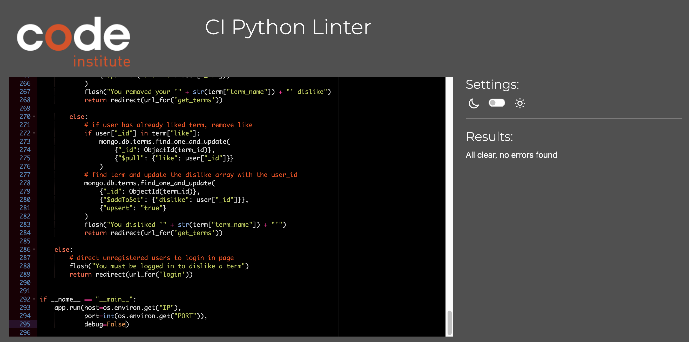

# Speak EV

Speak EV is a crowdsourced dictionary of terms and jargon related to electric vehicles (EVs). The site allows any visiter to view the dictionary and for registered users to add their own terms to it. 

The primary technologies used to form the basis of this website are the coding languages HTML, CSS, JavaScript, Python, the Flask micro framework and template language Jinja. The forementioned were used in conjunction with the document based, non-relational database, MongoDB and deployed on Heroku.

[View the live site here](https://speak-ev.herokuapp.com/)

&nbsp;


&nbsp;

# Table of Contents
  * [UX and UI](#ux-and-ui)
    * [Research](#research)
    * [Owner Goals](#owner-goals)
    * [User Stories](#user-stories)
    * [User Requirements and Expectations](#user-requirements-and-expectations)
    * [Design](#design)
    * [Wireframes](#wireframes)
  * [Features](#features)
    * [Existing Features](#existing-features)
    * [Features to be Implemented in the Future](#features-to-be-implemented-in-future)
  * [Data Model](#data-model)
  * [Technologies Used](#technologies-used)
    * [Languages](#languages)
    * [Frameworks and Libraries](#frameworks-and-libraries)
    * [Testing and Validation Tools](#testing-and-validation-tools)
  * [Testing](#testing)
  * [Validation](#validation)
    * [HTML](#html)
    * [CSS](#css)
    * [Color Contrast](#color-contrast)
  * [Deployment](#deployment)
    * [Forking the GitHub Repository](#forking-the-github-repository)
    * [Making a Local Clone](#making-a-local-clone)
  * [Credits](#credits)

&nbsp;

# UX and UI

## Research

Research for the creation of this site was carried out by searching for various forms of EV dictionary currently in existance. A selection of sites found are shown below, all of which are generated by the site owner and don't allow for user generated additions.

* [My EV](https://www.myev.com/research/ev-101/ev-terminology)
* [Pod Point](https://pod-point.com/guides/driver/ev-dictionary)
* [Electrifying](https://www.electrifying.com/ev-dictionary)
* [Go Green](https://www.gogreenleasing.co.uk/blog/ev-dictionary)

&nbsp;

## Owner Goals

  * As the site owner, I want to create a user generated resource for recent and potential adoptors of EV technology.
  * As the site owner, I want to allow all visitors to the side to view the dictionary without the need to sign-up.
  * As the site owner, I want to allow site users to sign-up and add new terms to the dictionary.
  * As the site owner, I want to allow site users to edit and delete terms that they have previously submitted.
  * As the site owner, I want to allow a site admin to add new terms to the site.
  * As the site owner, I want to allow a site admin to edit and delete all terms on the site.

&nbsp;

## User Stories

### First Time Visitor
 
  * As a first time user, I want to immediately understand the purpose of the website.
  * As a first time user, I want to be able to browse the dictionary without having to sign-up.
  * As a first time user, I want to be able to easly find and read defintions for all dictionary terms.
  * As a first time user, I want to be able to search for keywords.
  * As a first time user, I want to be able to easily sign-up without having to supply a lot of information.

### Returning Visitor

  * As a returning user, I want to be able to browse the dictionary without having to sign-in.
  * As a returning user, I want to be able to sign-in and out easily.
  * As a returning user, I want to be able to add new terms to the dictionary.
  * As a returning user, I want to be able to see all terms that I have added all in one place.
  * As a returning user, I want to be able to find, edit, and delete terms that I have added.


&nbsp;

## User Requirements and Expectations

### Requirements

  * Familiar and intuitive design that negates any learning curve.
  * A reactive site that is user friendly and well presented on all types of device and screen sizes.
  * Adequate levels of color contrast across the site that presents content in an accessible and easy to read manner.
  * Appealing visual presentation that enhances the user experience.
  * Full CRUD functionality
    * Create: registed users can create new dictionary terms.
    * Read: all users can read all dictionary terms and definitions.
    * Update: registered users can update their own entries.
    * Delete: registered users can delete their own entries.

### Expectations

  * Feedback when interacting with the site that is also instructive.

&nbsp;

## Design

### Imagery
* An image of a Nissa Leaf EV charging was chosen as a hero image for the homepage. The Nissan Leaf was the world's first mass-market battery electric vechile (BEV) when it first arrived in 2010 and is now sold in 59 markets worldwide. It is an iconic vechile in the world of electric vehicles and was an obvious choice for visually demonstrating to the user that the site is related to EVs.

### Color Scheme

* Black (#000), white (#fff) and green (#76ff03) are the primary colors applied throughout the site. These are complemented by the use of various shades of grey (#bdbdbd, #eeeeee, #fafafa, #212121, #59595) red (#d50000, #ff1744) and blue (#1a237e, #1565c0). The main colors of black and white were chosen to provide a clean modern feel while providing excellent contrast. The green color was chosen as it is intrinsically linked to 'green' technologies while the bright lime shade was chosen to demonstrate the excitement of new EV technologies; all the while maintaining good contrast. Shades of grey are applied to provide definition from the background in such areas as the footer, forms, and on the collapsible text-area. They are also applied to text-input labels and to differentiate text in the collapsible text-area. Finally, shades of red are applied to the cancel and delete buttons while shades of blue are applied to text links; these were chosen in order to meet user expectations and existing conventions.

### Fonts

* The Google font of Rubik was chosen for the text throughout the site. It is from the sans serif font family with slightly rounded corners which give it a clean modern feel, in keeping with the overall site design asthetic. Additionally, the font is extremely ledgable providing good contrast in all colors and sizes.

### Structure

* The information architecture type used for this site is the hierarchical tree structure. This common structure allows for simple navigation throughout the site and allows for easy expansion of the site in the future. The use of the burger navigation icon, along with a floating return to top button, help to overcome the common issues with this structure on mobile devices.

<details>
<summary>Site Map</summary>


</details>

&nbsp;

## Wireframes

* Balsamiq Wireframes was used to create the wireframes for this site. 
Wireframes for mobile, tablet, and desktop can be found below:

  ### [Phone Wireframe](/readme-files/wireframes/speak-ev-wireframes-phone.pdf)

  ### [Tablet Wireframe](/readme-files/wireframes/speak-ev-wireframes-tablet.pdf)

  ### [Desktop Wireframe](/readme-files/wireframes/speak-ev-wireframes-desktop.pdf)

&nbsp;

[Back to top &uarr;](#speak-ev)

# Features 

## Existing Features

* Navigation Bar

  * Featured on all pages, the full responsive navigation bar includes links to the Home, Log In, and Sign Up pages for all unregistered site visitors.
  * When signed in, the navigation bar includes links to the Home, Profile, Add Term and Log Out pages for all registered users.
  * It is identical on each page to allow for easy navigation and good UX.
  * It allows the user to easily navigate from page to page across all devices without having to revert back to the previous page via the ‘back’ button.
  * The navigation menu will collapse into a burger icon on mobile screens allowing for a more user friendly and aesthetically pleasing experience.
  * When used on a mobile device a side navigation menu expands on the right hand side of the screen, displaying all options available on the desktop navigation bar.

    

    <details>
    <summary>Navbar: Mobile</summary>

    

    </details>
    
    <details>
    <summary>Sidenav: Mobile</summary>

    

    </details>

* Hero Image

  * An image of a Nissa Leaf EV charging is used as a hero image on the homepage. It is an iconic vechile in the world of electric vehicles and was an obvious choice for visually demonstrating to the user that the site is related to EVs.

    

* Homepage: Header

  * The homepage header contains a 'h1' element, with a tagline for the site, which is followed by a line of text that provides a simple and concise description of the site's purpose. At the bottom of this section lies hyperlinked text which links to the sign-up page (for non registered users) or add term page (for registered users).

    

* Search Panel

  * The search panel consists a text-input field, where users can type their search word, which is followed by a 'search' and 'reset' buttons. The text-input field is labeled, to indicate its purpose, and provides feedback to the user to ensure that they cannot submit an empty string. Search words can be submitted by an enter keypress or by clicking/pressing on the 'search' button and reset by clicking/pressing on the 'reset' button. 

    

* Homepage: Collapsible

  * The collapsible/accordian is used to display the term names and to show/hide the term definition; along with information regarding the user who submitted the term, the submission date and an alternative name for the term, if any. When a user clicks/touches a row on the collapsible, it reveals the term definition and a subsiquent click/touch hides it again. If a secondary row is selected, when another row is already open, the new row will open while the previously selected row will be hiden. Additionally, the site admin will have access to two further buttons within the open collapsible, allowing them to edit and delete terms; registered users will only have these buttons shown for their own terms. These 'edit' and 'delete' buttons link to the edit term page and a delete term modal respectively.

    

* Profile: Header

  * The profile header contains a 'h1' element, consiting of the user's name, which is followed by an 'add term' button which links to the add term page.

    

* Profile: Collapsible

  * The collapsible/accordian is used to display the term names and to show/hide the term definition; along with information regarding the user who submitted the term, the submission date and an alternative name for the term. Additionally, 'edit' and 'delete' buttons are available to the user which link to the edit term page and a delete term modal respectively. On the profile page, the terms listed are just those created by the session user. When a user clicks/touches a row on the collapsible, it reveals the term definition and a subsiquent click/touch hides it again. If a secondary row is selected, when another row is already open, the new row will open while the previously selected row will be hiden.

    

* Edit Term Form

  * A page header sits above the edit term form, containing a 'h1' element, it informs the user of their location within the site. The edit term form auto populates with the information pertaining to the selected term. This information can be updated and submitted using the 'edit term' button. If the changes are valid, a flash message will appear at the top of the screen notifying them that the term has been successfully updated. Should the edited term match an existing term, or alternative name for a term, they will be redirected to the homepage and they will receive a flash message notifying them that the term already exists within the dictionary.

    

* Delete Term Modal

  * Should the user, or admin, select the 'delete' button, within the collapsible, a modal will appear. The main modal text will ask the user if they are sure that they want to delete the slected term. Beneath this, is text stating that this action cannot be undone. A 'cancel' and a 'delete' button sit underneath the modal text with the former used to close the modal, without deleting the term, and the latter to confirm deletion. Should the deletion of the term be confimed, they will be redirected to the homepage and a flash message will appear notifying the user that the term has been successfully deleted.

    

* Add Term Form

  * A page header sits above the add term form, containing a 'h1' element, it informs the user of their location within the site. The add term form consists of two mandatord text-fields ('Term Name or Acronym' and 'Term Definition') and an optional text-field ('Alt Name'). The text-input fields are labeled, to indicate their purpose, and provide feedback to the user to ensure that they cannot submit an empty or invalid string. A complete form can be submitted using the 'add term' button. If the term name is valid, they will be redirected to the homepage and a flash message will appear at the top of the screen notifying them that the term has been successfully added to the dictionary. Should the new term match an existing term, or alternative name for a term, the add term form will reset to its default state and they will receive a flash message notifying them that the term already exists within the dictionary.

    

* Log-In Page

  * A page header sits at the top of the page containing a 'h1' element, it informs the user of their location within the site. The header is followed by two text-input fields for the user's 'username' and 'password' with a 'log in' button underneath. At the bottom of this section lies hyperlinked text which links to the log-in page, should the user be unregistered. The input fields are labeled, to indicate their purpose, and provide feedback to the user to ensure that they cannot submit an empty or invalid string. If the user details are valid, they will be redirected to the profile page and a flash message will appear at the top of the screen welcoming them. Should invalid user details be submitted, the user will receive a flash message notifying them of an incorrect username and/or password.

    

* Sign-Up Page

  * A page header sits at the top of the page containing a 'h1' element, it informs the user of their location within the site. The header is followed by two text-input fields for the user's desired 'username' and 'password' with a 'sign up' button underneath. At the bottom of this section lies hyperlinked text which links to the sign-in page, should the user already be registered. The input fields are labeled, to indicate their purpose, and provide feedback to the user to ensure that they cannot submit an empty or invalid string. If the user details are valid, they will be redirected to the profile page and a flash message will appear at the top of the screen notifying them that they have successfully signed up. Should the user's desired username already exist, they will receive a flash message notifying them that the username already exists. 

    

* Flash Message

  * The flash messages consist of simple black text highlighted by a green background. The flash messages provide useful information/feedback to users and are located directly under the navbar for maximum visibility.

    

* Back to Top Button

  * A floating back to top button was used to allow the user an easy means of returning to the nav bar, this is especially important for mobile devices where the content is stretched vertically. The button appears when users scroll 70px from the top of the page.

    

* Footer

  * The footer consists of copyright information and a mailto link which users can use to contact the site owner.

    


## Features to be Implemented in Future

  In the future...

&nbsp;

[Back to top &uarr;](#speak-ev)

# Data Model

  MongoDB was chosen as the database for this project. MongoDB is a non-relational database that has a flexible data model.

  <details>
  <summary>Speak-EVData Model</summary>

  

  </details>

&nbsp;

[Back to top &uarr;](#speak-ev)

# Technologies Used

## Languages
  * [HTML](https://en.wikipedia.org/wiki/HTML)
  * [CSS](https://en.wikipedia.org/wiki/CSS)
  * [JavaScript](https://en.wikipedia.org/wiki/JavaScript)
  * [Python](https://en.wikipedia.org/wiki/Python_(programming_language))

## Frameworks
  * [Flask](https://en.wikipedia.org/wiki/Flask_(web_framework))
  * [Materialize CSS](https://materializecss.com/)

## Template Engine
  * [Jinja](https://en.wikipedia.org/wiki/Jinja_(template_engine))

## Database
  * [MongoDB](https://en.wikipedia.org/wiki/MongoDB)

## Application Platform
  * [Heroku](https://en.wikipedia.org/wiki/Heroku)

## Version Control
  * [Git](https://en.wikipedia.org/wiki/Git)
  * [GitHub](https://en.wikipedia.org/wiki/GitHub)

## Libraries
  * [Font Awesome](https://fontawesome.com/)
    * Font Awesome was used to locate and import icons used throughout the site.
  * [Google Fonts](https://fonts.google.com/)
    * Google Fonts was used to import the 'Rubik' font used throughout the site.

## Testing and Validation Tools
  * [Chrome DevTools](https://developer.chrome.com/docs/devtools/)
    * Google Chrome DevTools was used to carry out manual testing on the website and to simulate mobile devices.
  * [W3C Markup Validation Service](https://validator.w3.org/#validate_by_input)
    * The W3C Markup Validation Service was used to check the markup validity of the html code. 
  * [W3C CSS Validation Service](https://jigsaw.w3.org/css-validator/#validate_by_uri)
    * The W3C CSS Validation Service was used to validate the css code.
  * [JSHint](https://jshint.com/)
    * The JSHint static code analysis tool was used to check if the JavaScript source code complies with coding rules.
  * [CI Python Linter](https://pep8ci.herokuapp.com/)
    * The Code Institute Python Linter ensures that the code is PEP8 compliant.
  * [Lighthouse](https://developer.chrome.com/docs/lighthouse/overview/)
    * Lighthouse was used to audit performance, accessibility, best practices and SEO across the website.
  * [a11y](https://color.a11y.com/)
    * The a11y Color Contrast Accessibility Validator was used to verify that the colour contrast across the site adhered to the WCAG 2.1 Guidelines.
  * [LambdaTest](https://www.lambdatest.com/)
    * LambdaTest was used to perform cross browser testing.

&nbsp;

[Back to top &uarr;](#speak-ev)

# Testing 

Testing information can be found in the [testing file][TESTING.md].

&nbsp;

[Back to top &uarr;](#speak-ev)

# Validation

## HTML
The [W3C Markup Validation Service](https://validator.w3.org/#validate_by_input) was used to validate the code. The code was successfully validated with no errors or warnings.

<details><summary>Home</summary>

</details>

<details><summary>Profile</summary>

</details>

<details><summary>Add Term</summary>

</details>

<details><summary>Edit Term</summary>

</details>

<details><summary>Log In</summary>

</details>

<details><summary>Sign Up</summary>

</details>

&nbsp;

## CSS
The [W3C CSS Validation Service](https://jigsaw.w3.org/css-validator/#validate_by_uri) was used to validate the code. The code was successfully validated with no errors or warnings.

<details><summary>CSS Validation</summary>

</details>

&nbsp;

## JavaScript
[JSHint](https://jshint.com/) was used to check if the JavaScript code complies with coding rules. The code was successfully validated with no errors or warnings.

<details><summary>JavaScript Validation</summary>

</details>

## Python
[CI Python Linter](https://pep8ci.herokuapp.com/) was used to check if the Python code is PEP 8 compliant. The code was successfully processed by the linter with no errors found.

<details><summary>Python Linting</summary>

</details>

&nbsp;

## Color Contrast
The color contrast accessibility validator [a11y](https://color.a11y.com/) was used to verify that the colour contrast across the site adhered to the [WCAG 2.1 Guidelines](https://www.w3.org/TR/WCAG21/).

<details>
<summary>Color Contrast Validation</summary>


</details>

&nbsp;

[Back to top &uarr;](#speak-ev)

# Deployment

## Creating a Gitpod Repository

A GitHub repository is used to store your project, with Git and GitHub used for version control. The following steps outline how to create a GitHub repository.
  1. Log in to GitHub.
  2. In the upper-right corner of any page, use the '+' drop-down menu and select 'New repository'.
  3. Give your repo a short, memorable name.
  4. Choose your repository visibility; 'Public' or 'Private'.
  5. Select Initialize this repository with a README.
  6. Click Create repository.

&nbsp;

## Forking the GitHub Repository

Forking the GitHub Repository makes a copy of the original repository on our GitHub account; allowing you to view and/or make changes without affecting the original repository and can be done by using the following steps.
  1. Log in to GitHub and locate the repository: [magic-8-ball](https://github.com/davecoll3/speak-ev).
  2. Once in the repository, navigate to the "Fork" button at the top right of the page; just above the settings button on the menu.
  3. You should now have a copy of the original repository in your GitHub account.

&nbsp;

## Making a Local Clone
  1. Log in to GitHub and locate the repository: [magic-8-ball](https://github.com/davecoll3/speak-ev).
  2. Under the repository name, click "Clone or download".
  3. To clone the repository using HTTPS, under "Clone with HTTPS", copy the link.
  4. Open Git Bash
  5. Change the current working directory to the location where you want the cloned directory to be made.
  6. Type `git clone` and then paste the URL you copied in Step 3.
  ```
  $ git clone https://github.com/YOUR-USERNAME/YOUR-REPOSITORY
  ```

  7. Press Enter. Your local clone will be created.

  ```
  $ git clone https://github.com/YOUR-USERNAME/YOUR-REPOSITORY
  > Cloning into `CI-Clone`...
  > remote: Counting objects: 10, done.
  > remote: Compressing objects: 100% (8/8), done.
  > remove: Total 10 (delta 1), reused 10 (delta 1)
  > Unpacking objects: 100% (10/10), done.
  ```

Click [Here](https://help.github.com/en/github/creating-cloning-and-archiving-repositories/cloning-a-repository#cloning-a-repository-to-github-desktop) to retrieve pictures for some of the buttons and more detailed explanations of the above process.

## Heroku Deployment: Project Setup

If you don't have a Heroku account, or if you have yet to install the Heroku CLI, see [How to Install the Heroku CLI](https://coding-boot-camp.github.io/full-stack/heroku/how-to-install-the-heroku-cli) before you proceed.

  1. Make sure that your project is initialized as a Git repository. You can check this by running the following command at the root of your project.
  ```
  git status
  ```

  2. If you encounter an error, that means that your project isn't yet a Git repository. You can initialize the repository by running the following command.
  ```
  git init
  ```

  3. Applications that feature an Express.js back end can use Heroku's PORT environment variable. To set this up, create a port variable with a value of process.env.PORT. You can also add a default value for local instances of your server by using the || syntax.
  ```
  const port = process.env.PORT || 3001
  ```

## Heroku Deployment: Create a Heroku App

Now that you have created the repository and configured the server, you can create an app on Heroku. Using the steps below, this can be done without opening the browser.
  1. Create a new Heroku app by running the following command in the root of your project:
  ```
  heroku create
  ```

  2. The Heroku CLI will randomly generate an app name, but you can specify a name using the following syntax.
  ```
  heroku create <app name>
  ```

  3. Once you have created the app, you can run 'git remote -v' to verify that the Heroku remote URL was added by the Heroku CLI
  ```
  git remote -v
  heroku  https://git.heroku.com/<heroku-app-name>.git (fetch)
  heroku  https://git.heroku.com/<heroku-app-name>.git (push)
  ```

  4. The remote URL gets added automatically to your Git repository without requiring any extra commands. You can now prepare for deployment.

## Heroku Deployment: Deploy to Heroku

  1. Add and commit all your project files, then push to Heroku.
  ```
  git add -A
  git commit -m "Pushing to Heroku"
  git push heroku main
  ```

  2. Confirm that the application was deployed successfully by visiting the application URL provided in the terminal. Sometimes the output will say that the build was successful, but you should still open your application in the browser to verify.
  ```
  remote: -----> Build succeeded!
  remote: -----> Discovering process types
  remote:        Procfile declares types     -> (none)
  remote:        Default types for buildpack -> web
  remote:
  remote: -----> Compressing...
  remote:        Done: 33.8M
  remote: -----> Launching...
  remote:        Released v9
  remote:        https://lit-retreat-65972.herokuapp.com/ deployed to Heroku
  ```

  3. Your app should now be deployed with a server to Heroku. The link will be accessible as long as your app exists on Heroku.

If you encounter any issues, further details on Heroku deployment and troubleshooting can be found [here](https://coding-boot-camp.github.io/full-stack/heroku/heroku-deployment-guide).

The live link can be found [here](https://speak-ev.herokuapp.com/)

&nbsp;

[Back to top &uarr;](#speak-ev)

# Credits 

## Content 

  * The Code Institute readme-template provided the basic structure for the readme.md file.
  * The Code Institute's Non-Relational Database Management Systems Mini Project was used to provide some basic structure and authentication.
  * The [Materialize CSS](https://materializecss.com/) front-end framework was used to supply components such as navbar, sidenav, collapsible, and search panel.

## Media

  * The favicon image was sourced from [Icons8](https://icons8.com) and was freely used under the [Icons8 licence](https://icons8.com/license).
  * The hero-image was sourced from [Unsplash](https://unsplash.com) and was freely used under the [Unsplash licence](https://unsplash.com/license).

## Code

  * The CSS code for changing the color of underline input and label in Materialize.css framework was sourced from [Stack Overflow](https://stackoverflow.com/questions/37127123/change-color-of-underline-input-and-label-in-materialize-css-framework) and is fully accredited within the code.
  * The JavaScript code for Materialize initialization was adapted from [Materialize](https://materializecss.com/) and is fully accredited within the code.
  * The JavaScript code for the bact to top button was adapted from [W3Schools](code adapted from w3schools: https://www.w3schools.com/howto/howto_js_scroll_to_top.asp) and is fully accredited within the code.

## Acknowledgements

  * I would like to thank my mentor, Oluwaseun Owonikoko, who assisted me on this project.
  * I would like to thank Iris Smok, the Code Insitiute's cohort facilitator for Coleg y Cymoedd, for her advice and encouragement.
  * I would also like to acknowledge the support and advice obtained from the Code Institute's Tutor Support and Slack community. 

  &nbsp;

  [Back to top &uarr;](#speak-ev)

[TESTING.md]: TESTING.md