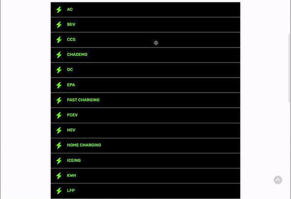
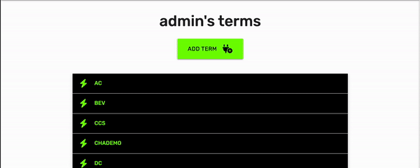
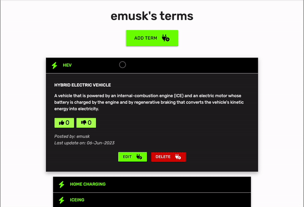
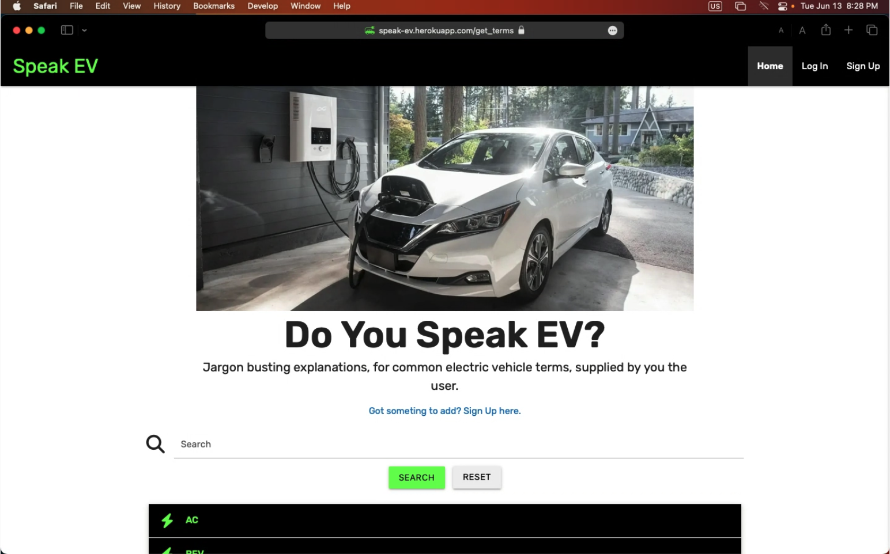
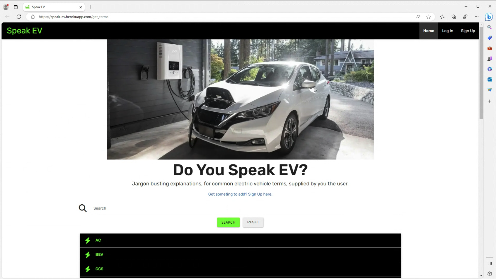
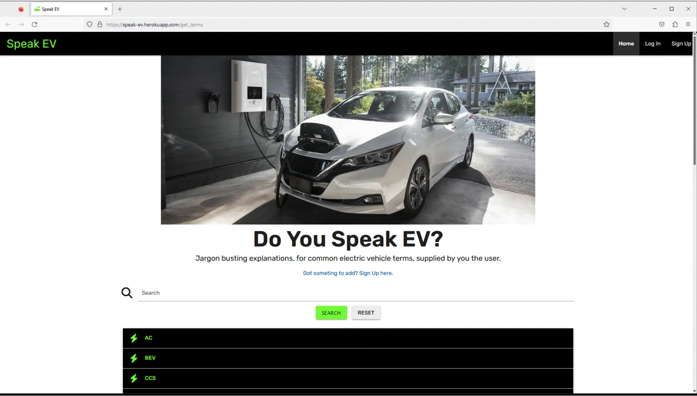
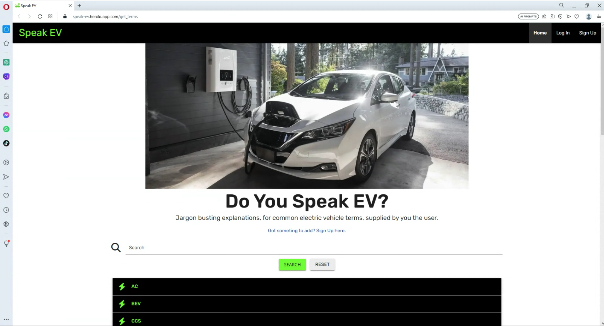
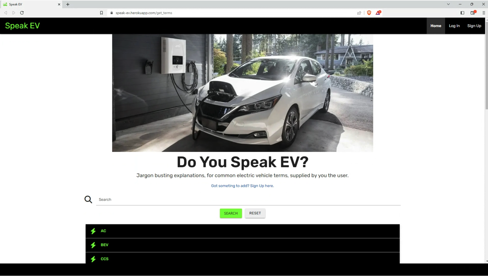

# Testing 

## Table of Contents   
* [Manual Testing](#manual-testing)
* [Lighthouse](#lighthouse)
* [Browser Compatibility](#browser-compatibility)
* [Bugs](#bugs)
* [Unresolved Bugs](#unresolved-bugs)

## Manual Testing

### Navbar
* Expected
  * The navbar should be located at the top of the page and disappear when the user scrolls down the page. 
  * The navbar should display the Speak EV logo and navigation links, maintaining good contrast with the background on all devices and screen sizes.
  * For unregistered users, or logged out users, the navigation links should include: Home, Log In and Sign Up.
  * For registered users, when logged in, the navigation links should include: Home, Profile, Add Term and Log Out.
  * On devices with a screen width of 992px or smaller, the navigation links should be hidden and be replaced with a burger menu icon.
  * On devices with a screen width of 992px or smaller, all navigation links should drop down in a sidenav when the burger icon is selected.
  * When clicked on, navigation links should bring the user to the relevant section of the website.

* Testing
  * The navbar was tested on a laptop with a screen width of greater than 992px in order to verify that the Speak EV logo and navigation links were displayed across the top of the page.
  * Chrome DevTools was used to simulate mobile devices and to check for reactiveness. A device with a screen width of less than 992px was emulated to ensure that the navigation menu collapsed down into a burger icon. This icon was then selected to ensure that all navigation links were revealed in a sidenav.
    <details><summary>Navbar Testing: Unregistered User</summary>
      
    </details>
    <details><summary>Navbar Testing: Registered User</summary>
      
    </details>

* Result
  * The navbar responded as expected in all of the above testing.
  * The navbar was found at the top of the page and disappeared when the user scrolled down the page.
  * The navigation links, for unregistered users and logged out users, include: Home, Log In and Sign Up.
  * The navigation links, for logged in registered users, include: Home, Profile, Add Term and Log Out.
  * On devices with a screen width of greater than 992px, the Speak EV logo and navigation links were displayed in a row within the navbar.
  * On devices, with a screen width of 992px or smaller, the navigation links collapsed into a burger icon. All navigation links were revealed in a sidenav when the burger icon was selected.

&nbsp;

### Main Heading Card

  * Expected
    * The hero image should display an image of an electric vehicle charging.
    * The hero image, header, and text should sit directly below the navbar and above the search panel.
    * The hero image, header, and text should be responsive on all devices and screen sizes
    * The hero image should be hidden on devices with a screen height of 480px or smaller.

  * Testing
    * The hero image, header, and text were tested for responsiveness on various screen sizes and devices using Chrome DevTools.
    * Testing was carried out on emulated devices with a screen height of 480px, or smaller, to ensure that it was hidden.
      <details><summary>Main Heading Card Testing</summary>
        
      </details>

  * Result
    * The hero image, header, and text responded as expected in all of the above testing.
    * The hero image, header, and text sit directly below the navbar and above the search panel.
    * The hero image, header, and text are responsive on all devices and screen sizes
    * The hero image is hidden on devices with a screen height of 480px or smaller.

&nbsp;

### Search Panel

  * Expected
    * The search panel should display a text input field, a 'search' button and a 'reset' button.
    * The search panel should sit directly below the main heading card and above the collapsible.
    * The search panel should be responsive on all devices and screen sizes
    * Dictionary terms should be searchable by typing into the text input field and submitted by an 'enter' keypress or selecting the 'search' button.
    * A valid query should result in a filtered list of terms appearing in the collapsible directly below the search panel.
    * If the term does not exist in the dictionary, a flash message stating 'No Results Found' should appear directly below the search panel.
    * Feedback should be provided to the user should their input be invalid.
    * Selecting the reset button should return the search panel to the default state.

  * Testing
    * The search panel was tested for responsiveness on various screen sizes and devices using Chrome DevTools.
    * Dictionary terms were searched by typing into the text input field and submitted using an 'enter' keypress and by selecting the 'search' button.
    * Invalid searches were attempted in order to elicit user feedback.
    * The reset button was selected in order to return the search panel to the default state. 
      <details><summary>Search Panel Testing</summary>
        
      </details>

  * Result
    * The search panel displays a text input field, a 'search' button and a 'reset' button.
    * The search panel sits directly below the main heading card and above the collapsible.
    * The search panel is responsive on all devices and screen sizes
    * Dictionary terms are searchable by typing into the text input field and submitted by an 'enter' keypress or selecting the 'search' button.
    * A valid query resulted in a filtered list of terms appearing in the collapsible directly below the search panel.
    * When a term does not exist in the dictionary, a flash message stating 'No Results Found' appears directly below the search panel.
    * Feedback is provided to the user when their input is invalid.
    * Selecting the reset button returns the search panel to the default state.

&nbsp;

### Collapsible

  * Expected
    * The collapsible should sit directly below the search panel and above the footer.
    * The collapsible should be responsive on all devices and screen sizes.
    * The collapsible should display only the term name when closed and terms should be organised in alphabetical order.
    * The collapsible should open when selected.
    * When open, the collapsible should also display the alternative term name (if any), the term definition, and information on who posted the term and when it was last updated.
    * When open, the collapsible should only display 'Edit' and 'Delete' buttons on terms created by the session user; these should appear on all terms for the admin.
    * The 'Edit' button should link to the edit term page while the 'Delete' button should trigger a modal asking if the user is sure that they want to delete the term.

  * Testing
    * The collapsible was tested for responsiveness on various screen sizes and devices using Chrome DevTools.
    * Various term names were selected to ensure that the collapsible was opening and closing as expected.
    * The admin was logged in to test if all 'Edit' and 'Delete' buttons were displaying to them. 
    * A non-admin user was logged in to test if 'Edit' and 'Delete' buttons were displaying to them only on terms they created.
    * The 'Edit' and 'Delete' buttons were selected to check if they triggered the expected actions.
      <details><summary>Collapsible Testing</summary>
        
      </details>
      <details><summary>Collapsible Buttons Testing</summary>
        
      </details>

  * Result
    * The collapsible sits directly below the search panel and above the footer.
    * The collapsible is responsive on all devices and screen sizes
    * The collapsible displays only the term name when closed and terms are organised in alphabetical order.
    * The collapsible opens when selected.
    * When open, the collapsible also displays the alternative term name (if any), the term definition, and information on who posted the term and when it was last updated.
    * When open, the collapsible only displays 'Edit' and 'Delete' buttons on terms created by the session user; these on all terms for the admin.
    * The 'Edit' button links to the edit term page while the 'Delete' button triggers a modal asking if the user is sure that they want to delete the term.

&nbsp;

### Profile Heading Card

  * Expected
    * The header and 'Add Term' button should sit directly below the navbar and above the collapsible.
    * The header and 'Add Term' button should be responsive on all devices and screen sizes
    * The header should display the user's name.
    * The 'Add Term' button should link to the add term page.

  * Testing
    * The header and 'Add Term' button were tested for responsiveness on various screen sizes and devices using Chrome DevTools.
    * It was verified that the heading displayed the user's name.
    * The 'Add Term' button was selected to check if it triggered the expected actions.
      <details><summary>Profile Heading Card Testing</summary>
        
      </details>

  * Result
    * The header and 'Add Term' button sits directly below the navbar and above the collapsible.
    * The header and 'Add Term' button is responsive on all devices and screen sizes
    * The header displays the user's name.
    * The 'Add Term' button links to the add term page.

&nbsp;

### Profile Collapsible

  * Expected
    * The collapsible should sit directly below the 'Add Term' button and above the footer.
    * The collapsible should be responsive on all devices and screen sizes.
    * The collapsible should display term names created by the current session user only.
    * The collapsible should display only the term name when closed and terms should be organised in alphabetical order.
    * The collapsible should open when selected.
    * When open, the collapsible should also display the alternative term name (if any), the term definition, and information on who posted the term and when it was last updated.
    * When open, the collapsible should display 'Edit' and 'Delete' buttons.
    * The 'Edit' button should link to the edit term page while the 'Delete' button should trigger a modal asking if the user is sure that they want to delete the term.

  * Testing
    * The collapsible was tested for responsiveness on various screen sizes and devices using Chrome DevTools.
    * Various term names were selected to ensure that the collapsible was opening and closing as expected.
    * It was verified that the terms displayed were only ones created by the current session user.
    * The 'Edit' and 'Delete' buttons were selected to check if they triggered the expected actions.
      <details><summary>Profile Collapsible Testing</summary>
        
      </details>

  * Result
    * The collapsible sits directly below the 'Add Term' button and above the footer.
    * The collapsible is responsive on all devices and screen sizes.
    * The collapsible displays term names created by the current session user only.
    * The collapsible displays only the term name when closed and terms are organised in alphabetical order.
    * The collapsible opens when selected.
    * When open, the collapsible also displays the alternative term name (if any), the term definition, and information on who posted the term and when it was last updated.
    * When open, the collapsible displays 'Edit' and 'Delete' buttons.
    * The 'Edit' button links to the edit term page while the 'Delete' button triggers a modal asking if the user is sure that they want to delete the term.

&nbsp;

### Add New Term Form

  * Expected
    * The form heading should be black with a white background and sit directly under the navbar.
    * The contact form should consist of three text-inputs (Term Name, Alt Name & Term Definition) and an 'Add Term' button.
    * All text boxes should contain placeholder text stating what their content should be and provide feedback if a submission attempt is made by a user who has not entered text in the two required fields. 
    * All content should be horizontally aligned to the centre of the page and be reactive to various devices and screen sizes.
    * Selecting the 'Add Term' button should add the term to the dictionary and redirect the user.
    * If the term name already exists in the dictionary, the form should not be submitted and a flash message should notify the user that the term already exists.
    * If the term name already exists in the dictionary as an alternative name for a different term, the form should not be submitted and a flash message should notify the user that the term already exists as an alternative name.
    * On laptops and desktops, the user should be provided with feedback when hovering over the 'Add Term' button as the color changes to a lighter shade of green.

  * Testing
    * The contact me section was tested for responsiveness on various screen sizes and devices using Chrome DevTools.
    * Attempts were made to submit incomplete and partially complete forms to verify that the form would only accept a completed form with the required fields completed.
    * It was verified that the 'Add Term' button successfully added the term to the dictionary and redirects the user.
    * It was also verified that the submit 'Add Term' button changed color by hovering over it with the cursor.
      <details><summary>Add New Term Form Testing</summary>
        
      </details>

  * Result
    * The form heading is black with a white background and sits directly under the navbar.
    * The contact form consists of three text-inputs (Term Name, Alt Name & Term Definition) and an 'Add Term' button.
    * All text boxes contain placeholder text stating what their content should be and provide feedback if a submission attempt is made by a user who has not entered text in the two required fields. 
    * All content is horizontally aligned to the centre of the page and be reactive to various devices and screen sizes.
    * Selecting the 'Add Term' button adds the term to the dictionary and redirects the user.
    * If the term name already exists in the dictionary, the form is not submitted and a flash message notifies the user that the term already exists.
    * If the term name already exists in the dictionary as an alternative name for a different term, the form is not submitted and a flash message notifies the user that the term already exists as an alternative name.
    * On laptops and desktops, the user is provided with feedback when hovering over the 'Add Term' button as the color changes to a lighter shade of green.

&nbsp;

### Log In Page

  * Expected
    * The log in page should consist of a page header, a username text-input, a password-input, a 'Log In' button and hyperlinked text linked to the sign-up page.
    * The log in heading should be black with a white background and sit directly under the navbar.
    * All input fields should contain placeholder text stating what their content should be and provide feedback if an invalid submission is attempted.
    * All content should be horizontally aligned to the centre of the page and be reactive to various devices and screen sizes.
    * Selecting the 'Log In' button should verify the user's submission and redirect them to their profile page if successful.
    * If the user submits an incorrect username and/or password they will remain on the log in page and receive a flash message notifying them that their username and/or password is incorrect.
    * On laptops and desktops, the user should be provided with feedback when hovering over the 'Log In' button as the color changes to a lighter shade of green.
    * The hyperlinked text should link to the sign up page.

  * Testing
    * The log in page was tested for responsiveness on various screen sizes and devices using Chrome DevTools.
    * Attempts were made to submit incomplete and partially complete fields to verify that only valid user information is accepted.
    * It was verified that the 'Log In' button verified valid user submissions and redirected them to their profile page.
    * It was also verified that the 'Log In' button changed color by hovering over it with the cursor.
      <details><summary>Log In Page Testing</summary>
        
      </details>

  * Result
    * The log in page consists of a page header, a username text-input, a password-input, a 'Log In' button and hyperlinked text linked to the sign up page.
    * The log in heading is black with a white background and sits directly under the navbar.
    * All input fields contain placeholder text stating what their content should be and provide feedback when an invalid submission is attempted. 
    * All content is horizontally aligned to the centre of the page and be reactive to various devices and screen sizes.
    * Selecting the 'Log In' button verifies the user's submission and redirects them to their profile page when successful.
    * When a user submits an incorrect username and/or password they remain on the log in page and receive a flash message notifying them that their username and/or password is incorrect.
    * On laptops and desktops, the user is provided with feedback when hovering over the 'Log In' button as the color changes to a lighter shade of green.
    * The hyperlinked text links to the sign up page.

&nbsp;

### Sign Up Page

  * Expected
    * The sign up page should consist of a page header, a username text-input, a password-input, valid password text, a 'Sign Up' button and hyperlinked text linked to the sign in page.
    * The sign up heading should be black with a white background and sit directly under the navbar.
    * All input fields should contain placeholder text stating what their content should be and provide feedback if an invalid submission is attempted.
    * All content should be horizontally aligned to the centre of the page and be reactive to various devices and screen sizes.
    * Selecting the 'Sign Up' button should verify the user's submission and redirect them to their profile page if successful.
    * If the user submits an username that already exists they will remain on the sign up page and receive a flash message notifying them that their desired username already exists.
    * If the user submits a password that isn't valid they will remain on the log in page and receive a flash message notifying them that their desired password isn't valid.
    * On laptops and desktops, the user should be provided with feedback when hovering over the 'Sign Up' button as the color changes to a lighter shade of green.
    * The hyperlinked text should link to the sign up page.

  * Testing
    * The log in page was tested for responsiveness on various screen sizes and devices using Chrome DevTools.
    * Attempts were made to submit incomplete and partially complete fields to verify that only valid user information is accepted.
    * It was verified that the 'Log In' button verifies valid user submissions and redirects them to their profile page.
    * It was also verified that the 'Log In' button changed color by hovering over it with the cursor.
      <details><summary>Sign Up Page Testing</summary>
        
      </details>

  * Result
    * The sign up page consists of a page header, a username text-input, a password-input, valid password text, a 'Sign Up' button and hyperlinked text linked to the sign in page.
    * The sign up heading is black with a white background and sits directly under the navbar.
    * All input fields contain placeholder text stating what their content should be and provide feedback when an invalid submission is attempted.
    * All content is horizontally aligned to the centre of the page and be reactive to various devices and screen sizes.
    * Selecting the 'Sign Up' button verifies the user's submission and redirects them to their profile page when successful.
    * When a user submits an username that already exists they remain on the sign up page and receive a flash message notifying them that their desired username already exists.
    * When a user submits a password that isn't valid they remain on the log in page and receive a flash message notifying them that their desired password isn't valid.
    * On laptops and desktops, the user is provided with feedback when hovering over the 'Sign Up' button as the color changes to a lighter shade of green.
    * The hyperlinked text links to the sign up page.

&nbsp;

### Flash Messages

  * Expected
    * The flash messages should appear as green text on a green background and be centrally aligned.
    * The flash messages should generally appear just under the navbar but above all other page content; the exception being the 'No Results Found' flash message which should be located directly below the search panel.
    * The flash messages should provide relevant feedback to the user.

  * Testing
    * The flash message was tested for responsiveness on various screen sizes and devices using Chrome DevTools.
    * It was verified that the flash message appears as and when expected.
    * It was verified that the flash message text contained relevant feedback for the user.
      <details><summary>Flash Message Testing</summary>
        
        
        
        
        
        
      </details>

  * Result
    * The flash messages appear as green text on a green background and are centrally aligned.
    * The flash messages generally appear just under the navbar but above all other page content; the exception being the 'No Results Found' flash message which is located directly below the search panel.
    * The flash messages provide relevant feedback to the user.

&nbsp;

### Back to Top Button

  * Expected
    * The back to top button should be found in the bottom right corner of the page and bring the user back to the top of the page when clicked on.
    * The back to top button should be hidden until the user scrolls 70px down from the top of the page.
    * The back to top button should be unobtrusive and semi transparent.
    * On laptops and desktops, the user should be provided with feedback when hovering over the back to top button as the color changes to a darker shade of grey, a 'Back to Top' label should also be displayed.

  * Testing
    * The back to top button was tested by scrolling down on all site pages and clicking on it to return to the top of the page; Chrome DevTools was used to simulate mobile devices.
    * It was verified that the back to top button was hidden before appearing when scrolling down the page.
    * It was also verified that the back to top button changed color by hovering over it with the cursor and a 'Back to Top' label is also displayed.
      <details><summary>Back to Top Button Testing</summary>
        
      </details>

  * Result
    * The back to top button responded as expected in all of the above testing.
    * The back to top button is hidden until the user scrolls 70px down from the top of the page.
    * The back to top button is present and brings the user back to the top of the page on all pages, screen sizes and devices. 
    * On laptops and desktops, the back to top button changes color upon hovering over it with the cursor, a 'Back to Top' label is also displayed.

&nbsp;

### Footer

  * Expected
    * The footer should be located at the bottom of the page and contain a mailto text link and copyright text, aligned centrally.
    * The mailto link should open a new email tab for the user with the 'To' and 'Subject' fields pre-populated.
    * The footer text should have good contrast with the background.

  * Testing
    * The footer was tested for responsiveness on various screen sizes and devices using Chrome DevTools.
    * It was verified that the footer text maintained good contrast with the background image.
    * The mailto link was tested to check that it opens a new email tab for the user with the 'To' and 'Subject' fields pre-populated.
    * Testing was carried out across various devices and screen widths to ensure that the footer text remained horizontally aligned to the centre of the page.
      <details><summary>Footer Testing</summary>
        
      </details>

  * Result
    * The footer is located at the bottom of the page and contains a mailto text link and copyright text.
    * The mailto link opens a new email tab for the user with the 'To' and 'Subject' fields pre-populated.
    * The footer text has good contrast and is horizontally aligned to the centre of the page on all devices and screen sizes.

&nbsp;

[Back to top &uarr;](#testing)

## Lighthouse
[Lighthouse](https://developer.chrome.com/docs/lighthouse/overview/) was used to audit performance, accessibility, best practices and SEO across the website.

  * Desktop
    * [Lighthouse Report: Home](readme-files/lighthouse/home-desktop.pdf)
    * [Lighthouse Report: Profile](readme-files/lighthouse/profile-desktop.pdf)
    * [Lighthouse Report: Add Term](readme-files/lighthouse/add-term-desktop.pdf)
    * [Lighthouse Report: Log In](readme-files/lighthouse/log-in-desktop.pdf)
    * [Lighthouse Report: Sign Up](readme-files/lighthouse/sign-up-desktop.pdf)

    &nbsp;

  * Mobile
    * [Lighthouse Report: Home](readme-files/lighthouse/home-mobile.pdf)
    * [Lighthouse Report: Profile](readme-files/lighthouse/profile-mobile.pdf)
    * [Lighthouse Report: Add Term](readme-files/lighthouse/add-term-mobile.pdf)
    * [Lighthouse Report: Log In](readme-files/lighthouse/log-in-mobile.pdf)
    * [Lighthouse Report: Sign Up](readme-files/lighthouse/sign-up-mobile.pdf)

&nbsp;

[Back to top &uarr;](#testing)

## Browser Compatibility

[LambdaTest](https://www.lambdatest.com/) was used to test the site across a number of browsers, including:

### Chrome: Windows
  <details><summary>Speak EV on Chrome.</summary>
  
  </details>
  
  &nbsp;

  ### Chrome: Android
  <details><summary>Speak EV on Chrome (Android).</summary>
  
  </details>

  &nbsp;

  ### Safari: MacOS
  <details><summary>Speak EV on Safari.</summary>
  
  </details>

  &nbsp;

  ### Safari: iOS
  <details><summary>Speak EV on Safari (iOS).</summary>
  
  </details>

  &nbsp;

  ### MS Edge: Windows
  <details><summary>Speak EV on MS Edge.</summary>
  
  </details>

  &nbsp;

  ### Firefox: Windows
  <details><summary>Speak EV on Firefox.</summary>
  
  </details>

  &nbsp;

  ### Opera: Windows
  <details><summary>Speak EV on Opera.</summary>
  
  </details>

  &nbsp;

  ### Brave: Windows
  <details><summary>Speak EV on Brave.</summary>
  
  </details>

&nbsp;

[Back to top &uarr;](#testing)

## Bugs

### Function: get_terms
  During the development of the project the get_terms function was causing a type error

  <details><summary>Type Error Screenshot</summary>
  
  </details>

  After researching TypeError: object of type 'Cursor' has no len(), it was discovered that the use of terms = mongo.db.terms.find() was causing the bug; as shown below.
  ```
    @app.route("/get_terms")
    def get_terms():
        terms = mongo.db.terms.find()
        return render_template("terms.html", terms=terms)


    @app.route("/search", methods=["GET", "POST"])
    def search():
        query = request.form.get("query")
        terms = list(mongo.db.terms.find({"$text": {"$search": query}}))
        return render_template("terms.html", terms=terms)
  ```

  This was resolved by changing terms to equal list(mongo.db.terms.find()); as below.
  ```
    @app.route("/get_terms")
    def get_terms():
        terms = list(mongo.db.terms.find())
        return render_template("terms.html", terms=terms)
  ```

&nbsp;

### Function: edit_term
  During testing it was noticed that when updating an existing term in the dictionary, you could not update alternative name or term definition due to the python code to prevent duplication of terms in the dictionary. This was caused by the re-use of code from the add_term function for new terms; this prevents terms being added if the term already exists in the dictionary as a term name or alternative name. However, this is not practical for updating terms and this check should only be required if the term name is being changed.

  The code causing this bug can be seen here:
  ```
    # edit term function find & edit an existing term on the dictionary
    @app.route("/edit_term/<term_id>", methods=["GET", "POST"])
    def edit_term(term_id):
        if request.method == "POST":
            # check if term already exists in the database
            existing_term = mongo.db.terms.find_one(
                {"term_name": request.form.get("term_name").upper()})

            # check if term already exists as an alternative_name in the database
            existing_alt_term = mongo.db.terms.find_one(
                {"alternative_name": request.form.get("term_name").upper()})

            if existing_term:
                flash("Sorry, this term already exists")
                return redirect(url_for("get_terms"))

            elif existing_alt_term:
                flash("Sorry, this already term exists as and alternative name")
                return redirect(url_for("get_terms"))

            submit = {"$set": {
                "term_name": request.form.get("term_name").upper(),
                "alternative_name": request.form.get("alternative_name").upper(),
                "term_definition": request.form.get("term_definition"),
                "created_by": session["user"],
                "created_on": datetime.today().strftime("%d-%b-%Y")
            }}
            mongo.db.terms.update_one({"_id": ObjectId(term_id)}, submit)
            flash("Term Successfully Updated on Dictionary")

        term = mongo.db.terms.find_one({"_id": ObjectId(term_id)})
        return render_template("edit_term.html", term=term)
  ```
  This bug was resolved by adding an if statement that first checked if the term name, for the term being updated, is not equal to the updated term being submitted. If it is not, the checks would then take place to see if this term already exists in the dictionary and prevent duplication.

  The updated code used to resolve this bug can be seen here:
  ```
    # edit term function find & edit an existing term on the dictionary
    @app.route("/edit_term/<term_id>", methods=["GET", "POST"])
    def edit_term(term_id):
        if request.method == "POST":
            # get term to update
            term_to_update = mongo.db.terms.find_one(
                {"_id": ObjectId(term_id)})

            # if updating term name
            if term_to_update["term_name"] != request.form.get(
                                                "term_name").upper():
                # check if term already exists in the database
                existing_term = mongo.db.terms.find_one(
                    {"term_name": request.form.get("term_name").upper()})

                # check if term already exists as an alternative_name in the db
                existing_alt_term = mongo.db.terms.find_one(
                    {"alternative_name": request.form.get("term_name").upper()})

                if existing_term:
                    flash("Sorry, this term already exists")
                    return redirect(url_for("get_terms"))

                elif existing_alt_term:
                    flash("Sorry, this already term exists as an alternative name")
                    return redirect(url_for("get_terms"))

            else:
                submit = {"$set": {
                    "term_name": request.form.get("term_name").upper(),
                    "alternative_name":
                        request.form.get("alternative_name").upper(),
                    "term_definition": request.form.get("term_definition"),
                    "created_by": session["user"],
                    "created_on": datetime.today().strftime("%d-%b-%Y")
                }}
                mongo.db.terms.update_one({"_id": ObjectId(term_id)}, submit)
                flash("Term Successfully Updated on Dictionary")

        term = mongo.db.terms.find_one({"_id": ObjectId(term_id)})
        return render_template("edit_term.html", term=term)
  ```

&nbsp;

### Profile Collapsible Not Displaying
  During development, attempts to display the collapsible on the Profile page were proving unsuccessful; the collapsible was displaying without issue on the Home page. After much trial and error the code causing this bug was narrowed down to the app.py file. The code causing the bug was located in the profile function, as below.
  ```
    # profile function to find session user's username
    @app.route("/profile/<username>", methods=["GET", "POST"])
    def profile(username):
        # take the session user's username from the database
        username = mongo.db.users.find_one(
            {"username": session["user"]})["username"]

        if session["user"]:
            terms = list(mongo.db.terms.find().sort("term_name", 1))
            return render_template("profile.html", username=username)

        return redirect(url_for("login"))
  ```

  After comparing the above code to the get_terms function, used to render the home page, it was discovered that terms=terms was not being passed to the profile function.
  The updated code, used to resolve this issue, is as below.
  ```
  if session["user"]:
        terms = list(mongo.db.terms.find().sort("term_name", 1))
        return render_template("profile.html", terms=terms, username=username)
  ```

&nbsp;

### Collapsible Background Color
  During testing it was noted that the collapsible occasionally changed color when being selected. 

  <details><summary>Collapsible Bug Screenshot</summary>
  
  </details>
  
  This was happening despite the css collapsible stating that the background color should be black; as below.
  ```
  .collapsible-header {
    background-color: #000;
    color: #76ff03;
  }
  ```
  
  However, after some research it was discovered that Materialize CSS was the cause of this bug and it could be overcome with the use of !important with the style.css file; as below.
  ```
  .collapsible-header {
    background-color: #000 !important;
    color: #76ff03;
  }
  ```

&nbsp;

### Input Field Color
  During testing it was noted that the input field icons were unexpectedly changing color when the input field was active; this was also happening with the underlining for the text.

  <details><summary>Collapsible Bug Screenshot</summary>
  
  </details>
  
  This was happening despite the css stating that the color should be black; as below.
  ```
    .input-field input[type=text]:focus + label, .materialize-textarea:focus:not([readonly]) + label {
        color: #000 !important;
    }

    .input-field input[type=password]:focus + label, .materialize-textarea:focus:not([readonly]) + label {
        color: #000 !important;
    }
  ```
  
  However, after some research it was discovered that Materialize CSS was the cause of this bug and it could be overcome by changing the color when in an active state in the style.css file; as below.
  ```
    .input-field .prefix.active {
        color: #000 !important;
    }
  ```

&nbsp;

[Back to top &uarr;](#testing)

## Unresolved Bugs

### Partial Search
  During the testing phase, it was noted that the search function will only return results if the full search term exists in the dictionary. For example, searching for 'EV' will not return the dictionary term 'BEV'. Ideally, users should be able to search for full or partial terms and get all results. Unfortunately, not enough time was available to resolve this bug. The code that needs updating for this can be found below.
  ```
    @app.route("/search", methods=["GET", "POST"])
    def search():
        query = request.form.get("query")
        terms = list(mongo.db.terms.find({"$text": {"$search": query}}))
        return render_template("terms.html", terms=terms)
  ```

### Collapsible Not Vertically Centering on Page
  During the testing phase, it was noted that the collapsible occasionally will display its contents below the fold when open. This means that the user has to scroll to reveal the contents and does not create a good user experience. Ideally, some JavaScript could be added to ensure that the open collapsible centres itself vertically.
 
 ### Navbar Menu Items Not Active
   Materialize allows for an active class to be added to the menu < li > elements to highlight, on the navbar, which page the user is currently on. However, due to the navbar code only appearing on the base.html file, it is not as simple to implement as is shown in the Materialize documentation and requires further jinja or JavaScript code to achieve this. In order to mitigate the effects of this, page headers are used to help signpost the current page to users.

&nbsp;

[Back to top &uarr;](#testing)

[Back to README.md doc](README.md)