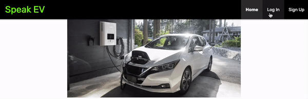
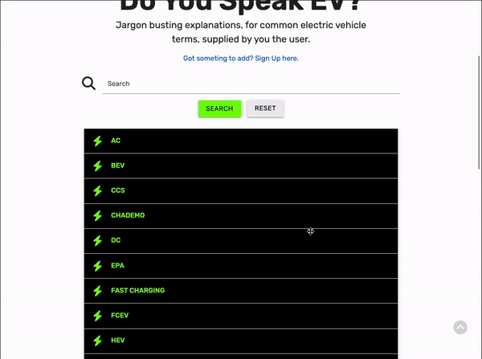

# Testing 

## Table of Contents   
* [Manual Testing](#manual-testing)
* [Lighthouse](#lighthouse)
* [Browser Compatibility](#browser-compatibility)
* [Bugs](#bugs)

## Manual Testing

### Navbar
* Expected
  * The navbar should be located at the top of the page and disappear when the user scrolls down the page. 
  * The navbar should display the Speak EV logo and navigation links, maintaing good contrast with the background on all devices and screen sizes.
  * For unregistered users, or logged out users, the navigation links should include: Home, Log In and Sign Up.
  * For registered users, when logged in, the navigation links should include: Home, Profile, Add Term and Log Out.
  * On devices with a screen width of 992px or smaller, the navigation links should be hidden and be replaced with a burger menu icon.
  * On devices with a screen width of 992px or smaller, all navigation links should drop down in a sidenav when the burger icon is selected.
  * When clicked on, navigation links should bring the user to the relevant section of the website.

* Testing
  * The navbar was tested on a laptop with a screen width of greater than 992px in order to verify that the Speak EV logo and navigation links were displayed across the top of the page.
  * Chrome DevTools was used to simulate mobile devices and to check for reactiveness. A device with a screen width of less than 992px was emulated to ensure that the navigation menu collapsed down into a burger icon. This icon was then selected to ensure that all navigation links were revealed in a sidenav.
    

Navbar Testing: Unregistered User

      
    

    

Navbar Testing: Registered User

      
    

* Result
  * The navbar responded as expected in all of the above testing.
  * The navbar was found at the top of the page and disappeared when the user scrolled down the page.
  * The navigation links, for unregistered users and logged out users, include: Home, Log In and Sign Up.
  * The navigation links, for logged in registered users, include: Home, Profile, Add Term and Log Out.
  * On devices with a screen width of greater than 992px, the Speak EV logo and navigation links were displayed in a row within the navbar.
  * On devices, with a screen width of 992px or smaller, the navigation links collapsed into a burger icon. All navigation links were revealed in a sidenav when the burger icon was selected.

&nbsp;

### Main Heading Card

  * Expected
    * The hero image should display an image of an electric vehicle charging.
    * The hero image, header, and text should sit directly below the navbar and above the search panel.
    * The hero image, header, and text should be responsive on all devices and screen sizes
    * The hero image should be hidden on devices with a screen height of 480px or smaller.

  * Testing
    * The hero image, header, and text were tested for responsiveness on various screen sizes and devices using Chrome DevTools.
    * Testing was carried out on emulated divices with a screen height of 480px, or smaller, to ensure that it was hidden.
      

Hero Image Testing

        
      

  * Result
    * The hero image, header, and text responded as expected in all of the above testing.
    * The hero image, header, and text sit directly below the navbar and above the search panel.
    * The hero image, header, and text are responsive on all devices and screen sizes
    * The hero image is hidden on devices with a screen height of 480px or smaller.

&nbsp;

### Search Panel

  * Expected
    * The search panel should display a text input field, a 'search' button and a 'reset' button.
    * The search panel should sit directly below the main heading card and above the collapsible.
    * The search panel should be responsive on all devices and screen sizes
    * Dictionary terms should be searchable by typing into the text input field and submitted by an 'enter' keypress or selecting the 'search' button.
    * A valid query should result in a filtered list of terms appearing in the collapsible direcly below the search panel.
    * If the term does not exist in the dictionary, a flash message stating 'No Results Found' should appear direcly below the search panel.
    * Feeback should be provided to the user should their input be invalid.
    * Selecting the reset button should return the search panel to the defalt state.

  * Testing
    * The search panel was tested for responsiveness on various screen sizes and devices using Chrome DevTools.
    * Dictionary terms were searched by typing into the text input field and submitted using an 'enter' keypress and by selecting the 'search' button.
    * Invalid searches were attempted in order to illicit user feedback.
    * The reset button was selected in order to return the search panel to the default state. 
      

Search Panel Testing

        
      

  * Result
    * The search panel displays a text input field, a 'search' button and a 'reset' button.
    * The search panel sits directly below the main heading card and above the collapsible.
    * The search panel is responsive on all devices and screen sizes
    * Dictionary terms are searchable by typing into the text input field and submitted by an 'enter' keypress or selecting the 'search' button.
    * A valid query resulted in a filtered list of terms appearing in the collapsible direcly below the search panel.
    * When a term does not exist in the dictionary, a flash message stating 'No Results Found' appears direcly below the search panel.
    * Feeback is provided to the user when their input is invalid.
    * Selecting the reset button returns the search panel to the defalt state.

&nbsp;

### Collapsible

  * Expected
    * The collapsible should sit directly below the the search panel and above the footer.
    * The collapsible should be responsive on all devices and screen sizes
    * The collapsible should display only the term name when closed.
    * The collapsible should open when selected.
    * When open, the collapsible should also display the alternative term name (if any), the term definition, and information on who posted the term and when it was last updated.

  * Testing
    * The collapsible was tested for responsiveness on various screen sizes and devices using Chrome DevTools.
    * Various term names were selected to ensure that the collapsible was opening and closing as expected.
      

Collapsible Testing

        
      

  * Result
    * The collapsible sits directly below the the search panel and above the footer.
    * The collapsible is responsive on all devices and screen sizes
    * The collapsible displays only the term name when closed.
    * The collapsible opens when selected.
    * When open, the collapsible also display the alternative term name (if any), the term definition, and information on who posted the term and when it was last updated.

&nbsp;

### Flash Messages

  * Expected
    * The flash messages should appear as green text on a green background and be centrally aligned.
    * The flash messages should generally appear just under the navbar but above all other page content; the exception being the 'No Results Found' flash message which should be located directly below the search panel.
    * The flash messages should provide relevant feedback to the user.

  * Testing
    * The flash message was tested for responsiveness on various screen sizes and devices using Chrome DevTools.
    * It was verified that the flash message appeard as and when expected.
    * It was verified that the flash message text contained relevant feedback for the user.
      

Flash Message Testing

        
        
        
        
        
        
      

  * Result
    * The flash messages appear as green text on a green background and be centrally aligned.
    * The flash messages generally appear just under the navbar but above all other page content; the exception being the 'No Results Found' flash message which is located directly below the search panel.
    * The flash messages provides relevant feedback to the user.

&nbsp;

### Back to Top Button

  * Expected
    * The back to top button should be found in the bottom right corner of the page and bring the user back to the top of the page when clicked on.
    * The back to top button should be hidden until the user scrolls 70px down from the top of the page.
    * The back to top button should be unintrusive and semi transparent.
    * On laptops and desktops, the user should be provided with feedback when hovering over the back to top button as the color changes to a darker shade of grey, a 'Back to Top' label should also be displayed.

  * Testing
    * The back to top button was tested by scrolling down on all site pages and clicking on it to return to the top of the page; Chrome DevTools was used to simulate mobile devices.
    * It was verified that the back to top button was hidden before appearing when scrolling down the page.
    * It was also verified that the back to top button changed color by hovering over it with the cursor and a 'Back to Top' label is also displayed.
      

Back to Top Button Testing

        
      

  * Result
    * The back to top button responded as expected in all of the above testing.
    * The back to top button is hidden until the user scrolls 70px down from the top of the page.
    * The back to top button is present and brings the user back to the top of the page on all pages, screen sizes and devices. 
    * On laptops and desktops, the back to top button changes color upon hovering over it with the cursor, a 'Back to Top' label is also displayed.

&nbsp;

### Footer

  * Expected
    * The footer should be located at the bottom of the page and contain a mailto text link and copyright text, aligned centrally.
    * The mailto link should open a new email tab for the user with the 'To' and 'Subject' fields pre-populated.
    * The footer text should have good contrast with the background.

  * Testing
    * The footer was tested for responsiveness on various screen sizes and devices using Chrome DevTools.
    * It was verified that the footer text maintained good contrast with the background image.
    * The mailto link was tested to check that it opens a new email tab for the user with the 'To' and 'Subject' fields pre-populated.
    * Testing was carried out across various devices and screen widths to ensure that the footer text remained horizontally aligned to the centre of the page.
      

Footer Testing

        
      

  * Result
    * The footer is located at the bottom of the page and contain a mailto text link and copyright text.
    * The mailto link opens a new email tab for the user with the 'To' and 'Subject' fields pre-populated.
    * The footer text has good contrast and is horizontally aligned to the centre of the page on all devices and screen sizes.

&nbsp;

[Back to top &uarr;](#testing)

## Lighthouse
[Lighthouse](https://developer.chrome.com/docs/lighthouse/overview/) was used to audit performance, accessibility, best practices and SEO across the website.

  * [Lighthouse Report: Desktop](#)
  * [Lighthouse Report: Mobile](#)

&nbsp;

[Back to top &uarr;](#testing)

## Browser Compatibility

[LambdaTest](https://www.lambdatest.com/) was used to test the site across a number of browsers, including:

### Chrome: Windows
  

Speak EV on Chrome.

  
  

  
  &nbsp;

  ### Chrome: Android
  

Speak EV on Chrome (Android).

  
  

  &nbsp;

  ### Safari: MacOS
  

Speak EV on Safari.

  
  

  &nbsp;

  ### Safari: iOS
  

Speak EV on Safari (iOS).

  
  

  &nbsp;

  ### MS Edge: Windows
  

Speak EV on MS Edge.

  
  

  &nbsp;

  ### Firefox: Windows
  

Speak EV on Firefox.

  
  

  &nbsp;

  ### Opera: Windows
  

Speak EV on Opera.

  
  

  &nbsp;

  ### Brave: Windows
  

Speak EV on Brave.

  
  

&nbsp;

[Back to top &uarr;](#testing)

## Bugs

### Bug 1
  During...

  

Bug Screenshot

  
  

  &nbsp;

### Bug 2
  During...

  

Bug Screenshot

  
  

  &nbsp;

[Back to top &uarr;](#testing)

[Back to README.md doc](README.md)